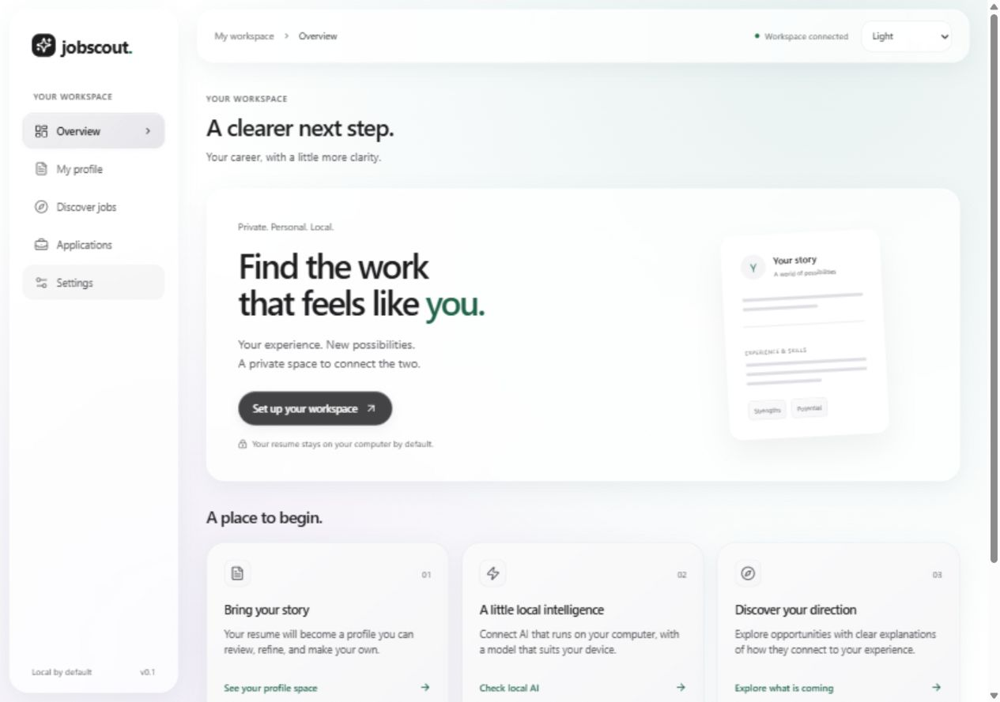
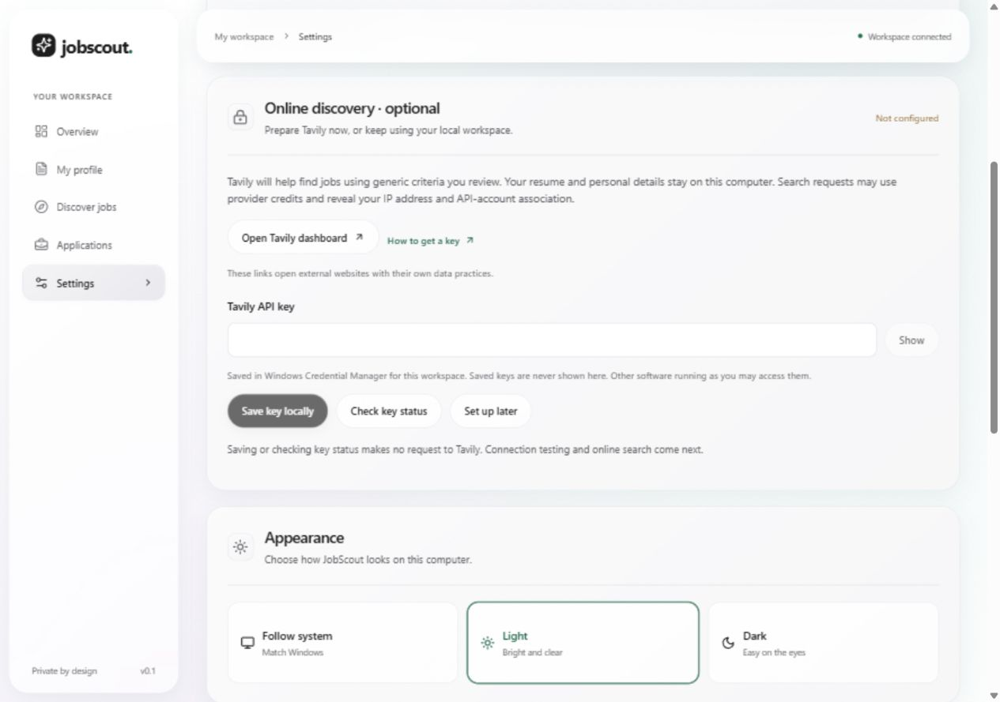
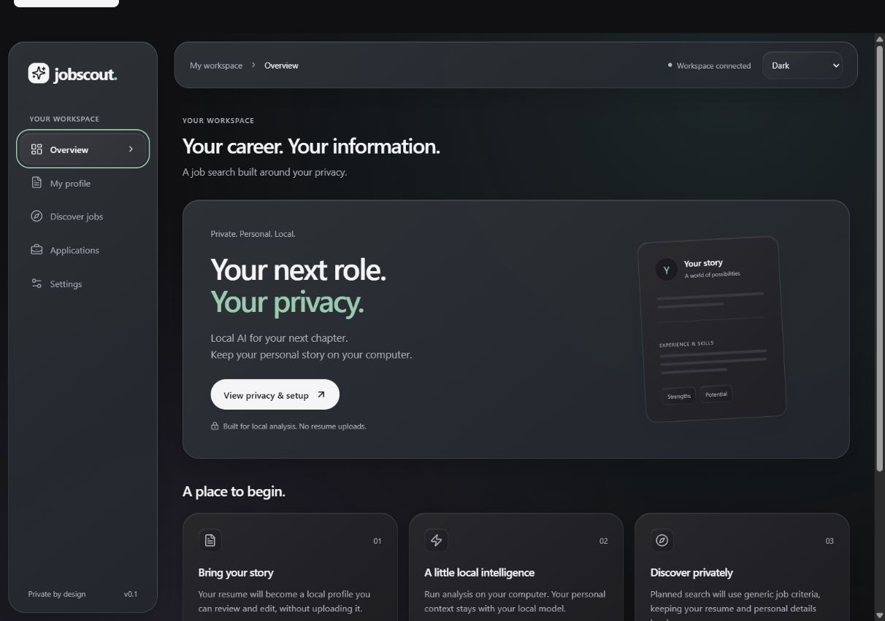
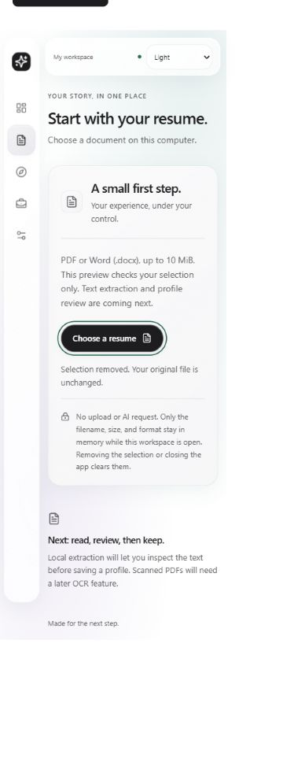
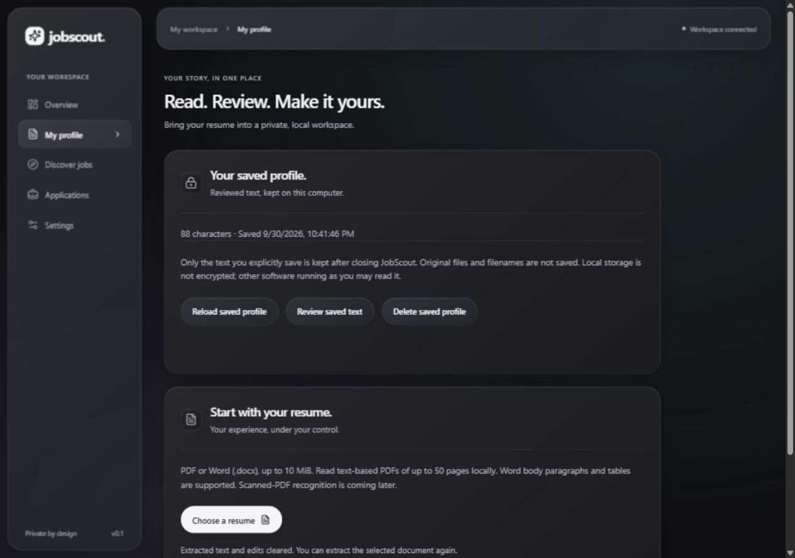

# JobScout Local

Find your next role. Keep your personal story private.

JobScout is an open-source Windows application designed to keep resumes, AI analysis, and career records on your computer. Its defining promise is local intelligence without uploading your personal career data. Built with Tauri 2, React, TypeScript, and a Python/FastAPI local engine.

**Status: early development, updated 2026-10-04.** Local resume import/review/storage, explicit Tavily discovery, conservative result deduplication, local filters and deterministic resume-assisted ordering are implemented. The current search returns up to ten web candidates; the core 30–50-job shortlist is still in progress. Local LLM summaries, embeddings, saved jobs and application tracking are planned. No model download is required for the current workflow.

The workspace now has Find jobs with Resume → Job options/Review query → Results steps, plus Settings. Historical screenshots below show earlier layouts and appearance treatments; they do not represent the current navigation.



Choose Light, Dark, or Follow system from the appearance control in Settings. The choice is remembered on this device. The Windows app uses the same interface in a Tauri desktop window; the browser preview is a development convenience.

Settings offers optional Tavily key setup: masked entry, Show/Hide, explicit save/replace/remove, local status and setup later. Keys use Windows Credential Manager separately for each workspace; there is no plaintext fallback. Saving/checking local key status makes no provider request. A separately reviewed connection check sends only the saved credential to the fixed HTTPS account-usage endpoint, with no resume or job criteria. Key acceptance does not guarantee credits or authorize a search. Find jobs requires confirmation of the actual engine query before dispatch. Stop waiting cannot recall a sent request. Saved keys are retained after uninstall; remove them in Settings or Windows Credential Manager. See [the credential contract](docs/architecture/0009-search-provider-secrets.md) and [connection-check contract](docs/architecture/0010-provider-connection-check.md).





The Resume step reads local text-based PDFs (up to 10 pages) and Word DOCX documents up to 10 MiB. Choosing a file starts extraction in a bounded, cancellable local worker. Review and correct the text, then select Generate suggested search to mark it reviewed and prepare local category suggestions. Saving is optional and explicit; imports and edits do not save automatically. Closing the app clears unsaved drafts. Word body paragraphs and tables are supported; headers, footers, images and embedded documents are omitted. Scanned PDFs need OCR, which is not implemented. Linked resources are never fetched.



The interface uses shared glass materials for navigation, panels, and controls, with responsive layouts and opaque accessibility fallbacks. See [the glass design rules](docs/design/glass.md). This is a Windows-compatible CSS treatment inspired by Liquid Glass; native Windows rendering and performance still need release checks.

## Run the development preview

Development prerequisites: Node.js 22.12+ (Node 24 recommended) and Python 3.11+. End-user packaging will bundle the engine; developers use a virtual environment.

Windows PowerShell, from the repository root:

```powershell
py -3.12 -m venv .venv
.\.venv\Scripts\python.exe -m pip install -e ".[dev]"
npm ci
npm run dev
```

If Python is installed under another name, use that executable to create `.venv`. An existing environment can be selected with `JOBSCOUT_PYTHON`. The Node scripts do not auto-load `.env` files; `.env.example` documents shell overrides.

Open [the development preview](http://127.0.0.1:1420). This starts both the real engine and the React interface. Press Ctrl+C to stop them. The engine uses an available loopback port and a random session credential. Preview database files are stored in `.local/`, which is ignored by Git.

Ollama is optional; its availability check does not enable model inference. When it is absent, the workspace continues running. No model downloads or search-provider requests run automatically.

## Run as a Windows desktop app

Install the official [Tauri Windows prerequisites](https://v2.tauri.app/start/prerequisites/): Rust with the MSVC toolchain, Microsoft C++ Build Tools, and WebView2 where needed. Then:

```powershell
.\.venv\Scripts\python.exe -m pip install -e ".[desktop]"
npm run desktop:dev
```

This packages the engine as a sidecar, starts Vite, and opens the Tauri window. Tauri owns the engine process and shuts it down when the application exits. Native app data goes in the OS application-data folder for `app.jobscout.local`.

Managed desktop development uses the ignored `work/desktop-dev` Cargo cache, separate from direct Cargo checks and release packaging. The first run rebuilds this cache; later runs reuse it. An explicit `CARGO_TARGET_DIR` override is respected.

If Tauri's build helper reports `Access is denied` while replacing `jobscout-engine.exe`, a running sidecar may be locking that build directory. Close the associated JobScout app and its development command normally before retrying. Use `npm run desktop:dev` from the repository root to select the managed development cache. Avoid running multiple desktop builds against the same cache. If an old elevated/orphaned sidecar cannot be identified safely, restart Windows; do not change filesystem permissions or stop unrelated Python processes. A custom `CARGO_TARGET_DIR` must also be free of running executables.

```powershell
npm run desktop:build
```

With the default target directory, the build creates a Windows NSIS installer under `apps/desktop/src-tauri/target/release/bundle/`. A `CARGO_TARGET_DIR` override moves the release executable and bundles to that directory. Reopen the fresh executable or update the installed app to use new code; an already-running or installed copy is separate. Rebuild/restart frontend and bundled engine together when their strict API contracts change.

The guided installer/onboarding design is in [installation.md](docs/design/installation.md). In-app Tavily key setup is implemented; the complete guided first-run wizard, model selection, custom model storage and download recovery remain planned. The initial installer is configured for the current Windows user.

Production engine packaging, Rust compilation and NSIS generation pass for the current code (latest installer approximately 22.09 MiB). This verifies packaging, not installer execution or current native interactions. Clean install, upgrade, uninstall, accessibility, themes and narrow-window behavior remain release checks.

## Structure

```text
apps/
  desktop/
    src/                 Resume/search workflow, Settings, local state and transport
    src-tauri/           Windows shell and engine process lifecycle
  engine/
    src/jobscout_engine/
      domain/            Public criteria, local suggestions/evidence, URL normalization
      adapters/          Restricted Tavily transport and Ollama availability
      app.py             Authenticated local API
      storage.py         SQLite profile persistence
    tests/               Import, persistence, privacy, transport and matching checks
scripts/                 Preview and sidecar packaging commands
docs/
  architecture/          Technical boundaries and decisions
  design/                Product flows
```

Parsing, discovery and personal analysis belong in the local engine behind small replaceable interfaces. The search adapter receives only validated public criteria; personal analysis has no provider or credential access. Future saved-job and tracker modules extend this modular monolith.

## Check a change

```powershell
npm run typecheck
npm run build
node --experimental-strip-types --test apps/desktop/tests/*.test.mjs
.\.venv\Scripts\python.exe -m pytest
```

Use Node 24 for the full frontend suite above (it uses TypeScript stripping). Exercise both resume and manual flows: review/correction → query preparation → explicit send → Results/filter/back/revise. Check provider setup, cancellation/retry, disconnected behavior, keyboard navigation, both themes, narrow windows and reduced motion using synthetic data. If pytest cannot use the system temp directory in a restricted environment, run it with `-p no:cacheprovider --basetemp=.local/pytest` instead. For native changes, also run `npm run desktop:build` on a prepared Windows machine.

Latest implementation validation: 275 engine tests, 51 frontend tests, production frontend build/typecheck and Windows packaging pass. Synthetic captured-request tests check that private fixture markers never enter provider requests. Current native interaction and deliberate live-search relevance evaluation remain pending; automated checks do not establish search quality or verified vacancies.

## Privacy and local connections

Our product contract is that resume files, extracted text, profiles, embeddings, match explanations, and application notes stay local. The current picker validates filename, size, and operating-system MIME metadata for immediate feedback; the engine independently validates file structure and resource limits. No hosted AI fallback, product analytics, advertising trackers, or automatic uploads of diagnostics are part of the design.

Explicit online discovery is implemented for local development through a restricted search adapter using only reviewed generic job criteria. Resume/profile data stays local. Interactive release checks and a deliberate live-provider search remain pending. A search provider can still see queries, connection metadata such as an IP address, and the account associated with an API key; JobScout does not currently provide network anonymity. Opening a job website or applying there creates a separate interaction with that site.

See [the privacy contract](docs/privacy.md) for the exact boundary, implementation requirements, and release checks. Privacy statements must describe verified behavior, not imply that planned safeguards already exist.

The engine binds only to `127.0.0.1`, requires a fresh app-session token on every API request, and does not enable cross-origin access. The browser preview uses narrowly scoped Vite proxy routes; the token is not embedded in frontend assets. Tauri uses fixed Rust commands to reach the engine. Resume bytes go only to this authenticated local engine; optional search credentials use Windows Credential Manager with no plaintext fallback.

## Next milestone

The first [production engine resource baseline](docs/resource-baseline.md) includes a reproducible Windows benchmark, measured startup/import memory, and provisional regression thresholds. Full desktop and installed measurements remain outstanding.

Milestone 17 remains the priority: bounded broader discovery toward 30–50 suitable unique jobs, local ranking/coverage evaluation and honest shortfall reporting. Every outbound query must remain reviewed, with request/cost/time limits and cancellation. Then add local job saving (18), application tracking (19), data controls (20), search-quality review (21), guided setup (22) and personal-alpha hardening (23).

Optional embeddings and semantic matching follow in milestones 24–26. Local generative runtime/inference follow in 27–28. Milestones 29–30 cover useful private structured summaries: primary/adjacent roles, skills/tools, industries, achievements, education/certifications and experience/seniority signals with source evidence, uncertainty and editable review. Model-assisted extraction can suggest roles; date-based experience totals require validated chronology, overlap handling and explicit assumptions. These features are planned. The current category detector does not summarize a career or calculate experience.

AI gap advice, resume tailoring, automatic applications and periodic background discovery remain later backlog items. Complete and evaluate the core shortlist first. Start with [the current memory checkpoint](MEMORY.md), [latest progress](docs/progress/2026-10-04.md) and [the roadmap](docs/roadmap.md). Also see [project instructions](AGENTS.md), [contribution guidance](CONTRIBUTING.md) and [the assisted-discovery architecture](docs/architecture/0007-assisted-discovery-and-applications.md).

Licensed under MIT. Model weights, provider services, and third-party dependencies retain their own licenses and terms.

## Saved profile data

Saved resume & data controls in the Resume step manage one explicitly saved text record in local SQLite storage. Saving replaces the previous saved text. Review saved text copies it into an editable draft; edits remain unsaved until reviewed and saved again. Discarding a draft or removing the selected document leaves saved text intact. Delete saved profile removes that record and clears the current import and draft, while keeping the original file. Storage is not encrypted, and deletion is not secure disk erasure or removal of external backups. Installer data-retention behavior remains unverified. See [the storage decision](docs/architecture/0003-reviewed-profile-storage.md).



## Try the first explicit search

Save your optional Tavily key in Settings, then return to Find jobs. Choose/review a local resume or select Search without a resume. Read the exact query/provider/data disclosure on the query face, then select Find jobs there to confirm and send one basic request. It may consume credits and returns up to ten text candidates. A saved key does not guarantee accepted authentication or available credits. No resume/profile data is sent.

With a resume, correct the extracted text and select Generate suggested search. Local word/alias rules identify supported roles/skills and open the engine query directly; correct public categories if needed, then explicitly select Find jobs on that query. If no supported role is detected, choose one manually. Without a resume, choose preferences/optional skills first. Results offer local category-mention filters and, for a reviewed resume, shared-skill ordering. Missing snippet details remain visible by default. This is a deterministic baseline; LLM summaries, nuanced qualifications and the larger shortlist remain planned. See [the two-path design](docs/architecture/0015-two-path-local-discovery.md).

Resume-assisted ordering counts shared skill categories once, with provider-order ties. Expand Why this candidate appears here to see exact phrases from the reviewed resume and returned title/snippet. Broad aliases can group different tools; a mention does not prove proficiency, a job requirement or suitability. Manual search preserves provider order. See [the local evidence decision](docs/architecture/0016-local-match-evidence.md).

Each retry requires explicit confirmation again. Stop waiting discards late replies but cannot undo a sent request. Editing criteria or opening Settings clears the preview/results. Results are session-only web search candidates with heuristic ordering, not verified vacancies or fit scores. Known tracking parameters and duplicate links are removed locally. Results show source domains, retrieval time (not listing date), and duplicate-link counts; different links may still describe the same vacancy. URLs are selectable text; the app does not open result websites or load their images. No automatic or background discovery. See [the normalization decision](docs/architecture/0014-candidate-link-normalization.md).

Synthetic API/privacy/rendering tests and Windows packaging pass. Browser/native interaction and a deliberate live-provider search remain unverified. See [the implementation contract](docs/architecture/0012-explicit-search-flow.md).

Tavily supplies web discovery through its direct HTTP API. The search-provider interface is replaceable; local matching and optional future models do not depend on Tavily. A usage-only connection check was previously exercised successfully; it does not establish real-search quality or current account availability.
