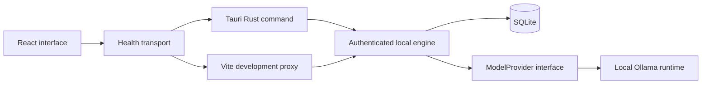

# 0001 — Local desktop foundation

Status: accepted for the foundation implementation.

## Architecture

The React interface runs in Tauri on Windows and in Vite during browser development. A transport module chooses a fixed Rust command in the desktop app or a same-origin Vite health proxy in the browser preview. Both talk to the same FastAPI engine.

## Process ownership

In the browser preview, `scripts/dev.mjs` owns both the engine and Vite. In the desktop app, Tauri starts a packaged Python engine using its sidecar support and stops it on exit. The Python process binds an available loopback port and emits a JSON `bound` event. That event announces a bound socket, not full application readiness; `/api/v1/health` verifies readiness after startup.

The parent creates a cryptographically random session token, passes it through the child environment, and keeps it out of the UI and logs. The health API checks bearer authentication. A browser page cannot access health through cross-origin requests; production has no health proxy.

## Current contract

`GET /api/v1/health` returns application version, database readiness, and the local model runtime status (`available`, `unavailable`, or `error`) with the number of installed models. A missing model runtime does not prevent the application engine from working. Runtime availability does not imply model selection or inference readiness.

The model adapter has a bounded timeout and ignores environment HTTP proxies for loopback requests. SQLite initialization and checks run outside the async event loop. No resume, provider secret, or job record is created during startup.

## Module boundaries

The governing data boundary is [the privacy contract](../privacy.md). Personal analysis and retrieval stay inside the local engine. When search is implemented, its adapter will accept only typed generic criteria from an outbound validation boundary, with no access to personal profile or resume storage. No such search boundary exists in the foundation yet; online search remains unavailable until it is implemented and verified.

- `domain/` owns provider-independent contracts.
- `adapters/` implements integrations.
- `storage.py` owns persistence; route handlers do not build SQL.
- `app.py` wires services and the authenticated API.
- React components render application state; `lib/engine.ts` owns communication.
- Native permissions allow only the specific external download URL used by the UI. Shell spawning is performed in Rust, with no general shell permission exposed to the webview.

Add resume ingestion, discovery, matching, and tracking modules when their first workflow is implemented. Introduce a task executor and persisted task states alongside the first long-running ingestion workflow. Define vector-storage interfaces when retrieval is added. This keeps boundaries deliberate without generating unused services.

## Experience

Establish a minimal interface with consistent spacing, locally available system fonts, neutral surfaces, a restrained green accent, clear navigation, reduced-motion support, and visible keyboard focus. Light, Dark, and Follow system appearance share semantic color tokens. The appearance choice is stored locally; only that non-sensitive preference is stored in the webview's local storage. An external startup script applies it before the interface paints, without relaxing the script content security policy. Follow system responds to changes in the operating system's color preference. Use real engine statuses and label planned features. All slow network operations are asynchronous; the UI remains navigable during health checks.

## Verification boundaries

Frontend type checking and production bundling verify React and the browser assets. Engine tests verify authentication, offline-model behavior, and repeatable database startup. Native Rust compilation, sidecar execution, and NSIS installation require the Windows toolchain and must be checked separately before a desktop release.
