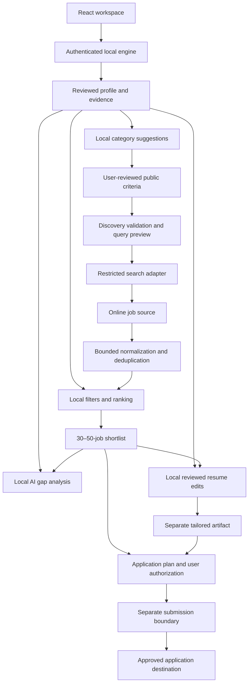

# 0007 — Assisted discovery and mature application workflows

Status: accepted implementation direction, 2026-10-01. The modules and records below are planned, except for the existing desktop/engine, import, saved-text and query-preview foundations. This decision does not enable online search or submission.

## Decision

Extend the existing React/Tauri/FastAPI/SQLite modular monolith. Deliver the 30–50 relevant-job shortlist first; add local AI gap analysis, resume tailoring and automatic applications in that order after evaluating the core. Use small typed interfaces and local background tasks rather than new hosted services. The governing contracts are [privacy](../privacy.md), [reviewed profile storage](0003-reviewed-profile-storage.md), [public criteria](0005-public-search-criteria.md) and [query construction](0006-public-query-boundary.md).

Discovery and submission are distinct outbound capabilities. Personal analysis has no network capability. Search receives only validated generic criteria; a future submission adapter receives only an explicitly approved application package for a verified recipient. No model may call either adapter directly. Module separation inside one process is an enforceable programming contract with tests, not an OS security sandbox.

## Responsibilities and replaceable interfaces

| Module | Responsibility and interface | Allowed inputs |
|---|---|---|
| Profile service | Review/save text; later derive editable structured facts with source spans, including role, seniority/experience signals, skills, tools, industries, achievements, education and certifications | Local resume text and user corrections |
| Criteria suggestions | Map evidence to fixed catalog identifiers; return suggestions for review | Local profile; no arbitrary outbound query text |
| Discovery service | Orchestrate bounded search, normalization and shortlist tasks | Reviewed criteria revision and local profile revision |
| SearchProvider | Search pages through the authoritative boundary and restricted transport | Validated PublicSearchCriteria, approved provider configuration and opaque cursor; no profile access |
| JobNormalizer | Produce canonical job records and duplicate groups | Bounded untrusted provider records |
| JobMatcher | Filter and rank; return reasons and evidence | Normalized jobs, reviewed profile facts and explicit preferences |
| LocalAnalysisProvider | Optional schema-constrained extraction/generation, timeout and cancellation | Local evidence; no network tools or hosted fallback |
| GapAnalyzer | Aggregate requirements and compare candidate evidence | Immutable shortlist/profile snapshots |
| ResumeTailor and DocumentExporter | Propose edits and export accepted changes | Selected job, reviewed resume evidence and accepted edits |
| ApplicationCoordinator | Prepare/review plans, authorize scoped submission and reconcile outcomes | User-selected jobs and reviewed packages |
| ApplicationAdapter | Supported form preparation/submission and receipt lookup where available | Destination-bound authorized package, never general database access |
| Local repositories | Versioned SQLite persistence and bounded artifact storage | Explicit local records; credentials resolved separately through OS-backed secret storage |

Add each interface with its first working slice. Domain contracts stay in domain modules, integration code in adapters, orchestration in services and persistence behind repositories. Fixed API routes/native commands expose workflows, not arbitrary HTTP, filesystem or shell access. Keep current saved-text storage compatible; structured facts and derived caches are additive future migrations rather than silently replacing the reviewed text.

### Role and experience interpretation

The future local analysis provider may suggest a primary role, adjacent roles and a seniority/experience band from dated employment, responsibility verbs, scope, tools and user corrections. Every suggestion must carry exact source spans, an uncertainty state and the model/taxonomy version. It may estimate signals such as “likely mid-level” or “about 3–5 years evidenced in the reviewed chronology” only when the source dates support that range; overlapping dates, incomplete resumes, internships, freelance work and ambiguous titles require a wider range or “not enough evidence.” It must never invent dates, employers, responsibilities or qualifications, infer seniority from a job title alone, or turn an unmentioned skill into a negative finding. Users review, edit or reject these facts before they influence local ranking. Only confirmed fixed catalog categories can reach the public query boundary.

## Core discovery pipeline

1. Build a local profile snapshot from explicitly reviewed text. Begin with deterministic skill aliases and editable facts; unknown facts remain unknown. Every derived fact points to text evidence or a user correction. Suggested public categories must pass the existing catalog boundary and user review.
2. Bind a search run to criteria/query/provider versions and a profile revision. Revalidate immediately before dispatch. Search expands only through bounded pages of approved generic queries; do not silently broaden reviewed filters or send private identifiers. Show provider-visible terms and quota guidance.
3. Fetch a larger candidate pool when needed to produce 30–50 suitable unique jobs. Define finite request, candidate, response-byte, elapsed-time and quota budgets in provider configuration before shipping. Stop at sufficient coverage, exhaustion, cancellation or a budget limit. Return useful partial results with the reason for stopping.
4. Normalize provider ID, title, company, canonical application/source URL, description text, source, retrieval time, published time when supported, and structured preferences with evidence. Strip active markup; never automatically fetch embedded resources. Canonicalization must not merge distinct postings merely because title/company match. Unsupported or unsafe links are unavailable for opening/submission.
5. Apply hard user filters locally where evidence supports them; provider query terms are only hints. Mark unknown location/work mode/seniority explicitly and expose whether unknowns are included. Do not claim an unknown field satisfies a hard filter.
6. Rank eligible jobs against the local profile using transparent weighted rules first. Record supported matches, gaps and missing evidence; do not use invented precision or claim hiring probability. Add embeddings only after comparative quality/resource evaluation. Select up to the configured 30–50 target without padding, with stable ordering and filter/match explanations.
7. Evaluate both the first ten and full shortlist using synthetic reviewed cases: filter adherence, relevance, duplicates, freshness uncertainty, source coverage, latency, cost and RAM. A raw web search hit is not automatically a usable job record; report insufficient job descriptions or source coverage honestly.

Profile edits invalidate derived matches; criteria/provider changes invalidate search approval and results' applicability. Preserve the old view with an explicit stale label while recomputing, and never allow late responses to replace newer state. No automatic background provider refresh without a separately defined user control.

## AI skills and certification gaps

Use the deduplicated shortlist snapshot as the analysis population. Local AI extracts requirement objects containing normalized skill/certification, required/preferred/unspecified classification, job ID, exact source span and confidence/uncertainty. Validate schema, span existence and bounds; reject unsupported output and count failed/insufficient descriptions separately. AI job text is data, never an instruction to access files or invoke tools.

Aggregate each requirement once per job, showing numerator, analyzed denominator and shortlist coverage. Compare with reviewed profile facts using explicit aliases and evidence. Report “not evidenced” rather than “missing” until confirmed by the user. Retain user corrections separately from generated suggestions; rank improvement areas by recurrence and required/preferred status, without claiming this sample represents the whole market. Cache by shortlist/profile/model/prompt/taxonomy versions, and invalidate on changes. Keep deterministic counts usable when local AI is skipped or unavailable.

## Job-specific resume tailoring

Generate a structured edit proposal for one selected job and resume revision: target section/span, before/after text, supporting profile fact IDs, relevant job evidence and reason. Validate citations and reject added qualifications without reviewed evidence. UI shows individual accept/reject controls and a full preview; edits never overwrite the source profile automatically.

Export an explicitly saved, separate tailored artifact with job association and revision. Formatting preservation is a separate exporter concern: current text extraction cannot guarantee reconstruction of the original PDF/DOCX layout. Offer an honest supported export/template first; preview the exported document and retain only user-requested versions. Never silently add credentials or submit during tailoring.

## Application preparation and automatic submission

Keep this feature disabled until a deliberate privacy-contract extension, destination policy and supported-integration checks are completed. The current discovery contract continues to prohibit personal outbound data. First ship local form preparation and user review; later support scoped automatic submission without a general-purpose autonomous browser agent.

An ApplicationPlan binds job/destination identity, exact resume artifact revision, field answers, attachments and payload digest. Approval records the visible recipients, personal data, selected jobs, action scope and expiry. Changing a recipient, answer or artifact revokes approval. Never generate answers to legal attestations or sensitive declarations without user input. Resolve credentials only for the intended integration; never persist them in a plan or log.

Persist a local attempt before the side effect. Use a unique job/destination application key and provider idempotency when supported. Planned states are draft → ready → authorized → submitting → submitted, failed or outcome_unknown; cancellation before dispatch becomes cancelled. Save minimal receipt/status evidence. After interruption during submitting, reconcile to outcome_unknown until a supported receipt check or the user establishes the outcome. Do not automatically resubmit uncertain attempts. A batch stop cancels undispatched work; it cannot retract a request already accepted by the recipient. Limit concurrency and respect integration limits. CAPTCHA, unsupported forms and platform restrictions return control to the user.

## Local data, responsiveness and recovery

Planned records: ProfileRevision and EvidenceRef; ReviewedCriteriaSnapshot; SearchRun and JobRecord; MatchAssessment; Requirement and GapReport; ResumeEditProposal and TailoredArtifact; ApplicationPlan, Approval and ApplicationAttempt. Store provenance and algorithm/model versions alongside derived records. Search history retention must be a deliberate user choice; transient runs remain session-only by default. Saved jobs, plans, artifacts and reports need explicit retention controls and bounded storage.

Use the existing cancellable import pattern as a starting point for local task orchestration: queued/running/completed/failed/cancelled states, bounded work outside the UI/event loop, progress by actual phase/count, and generation/revision checks. Persist only tasks that require recovery, especially submission attempts. Navigation and keyboard controls stay responsive; preserve selection/scroll and show partial results. Local analysis continues offline; missing AI exposes setup-later/retry rather than a hosted fallback.

Deletion removes owned derived facts, matches, indexes, reports and artifact copies linked to deleted data, with clear controls for records the user deliberately retains. Application receipts already sent externally cannot be deleted remotely by local cleanup. Resume originals and user-exported files are outside app-owned deletion. Use migrations, transactional writes and restart tests; do not promise encryption or secure disk erasure. Logs contain fixed operational codes and counts, never payloads, profile text, credentials or personal paths.

## Implementation and verification gates

| Stage | Deliver before advancing |
|---|---|
| Core | Provider setup/secret storage, restricted transport and captured-request privacy tests; normalization; deterministic local profile matching; bounded 30–50 shortlist with honest shortfalls, cancellation and quality evidence |
| Gap analysis | Optional local model setup; schema/evidence validation; deduplicated frequency math, coverage reporting, user correction and deletion tests |
| Tailoring | Grounded edit review, factual fidelity evaluation, separate artifact export/visual verification and original preservation |
| Automatic applications | Approved privacy-contract extension; supported adapters; scoped approval invalidation, duplicate prevention, uncertain-outcome recovery, batch stop and synthetic receipt tests before any live submission |

Every stage verifies offline/error recovery, malicious job content, deletion, native responsiveness, accessibility, Light/Dark/System and resource impact. Capture synthetic outbound requests to prove discovery never carries personal markers and submission sends only the reviewed package to approved destinations. Later stages do not delay the no-model core or introduce dependencies until an evaluated benefit warrants them.

Periodic discovery and its later unattended-application integration are specified separately in [decision 0008](0008-background-discovery-service.md). That design keeps the Windows service away from personal records and places user-scoped ranking, notification and standing application policy in a per-user scheduled agent.
