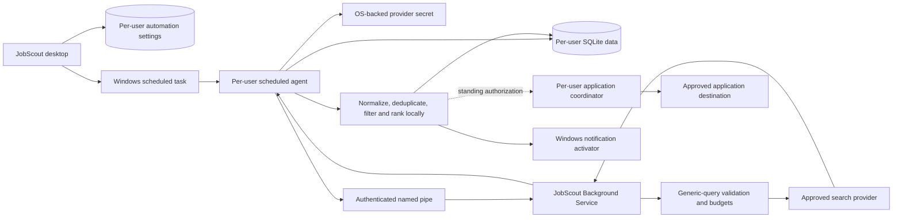

# 0008 — Windows background discovery service

Status: accepted future architecture, 2026-10-01. This is a mature-product design, not an implemented or enabled capability.

## Goal

Let a user opt into periodic job discovery after closing the desktop window. A configurable Windows Task Scheduler task starts a per-user background agent at the chosen interval. A restricted JobScout service, visible in `services.msc`, provides a stable broker for bounded provider requests and run coordination. The per-user agent filters, deduplicates and ranks results locally, then raises a Windows notification when new matching jobs are found.

The same pipeline may later prepare or submit applications under a separate, explicit standing authorization. Installing or enabling background discovery never enables automatic applications.

## Why the service and scheduled task are separate

Windows services run in Session 0 and cannot safely present interactive desktop UI. A machine service also should not receive blanket access to every Windows user's resume, application history, database or user-scoped secrets. Running a service as the interactive user would require fragile account credentials and complicate password changes.

Use this split:

- **JobScout Background Service:** an optional, least-privilege Windows service registered under a dedicated virtual service identity and visible in `services.msc`. It accepts authenticated local requests, enforces network/provider budgets, serializes provider calls and reports health. It receives only the same reviewed generic criteria allowed by the discovery privacy boundary. It has no profile, resume, tailored-document or application-answer access.
- **JobScout Scheduled Agent:** a per-user, noninteractive executable launched by a Windows Task Scheduler task. It runs in that user's security context, reads only that user's JobScout database and OS-backed provider credential, calls the service over a user-bound authenticated local IPC channel, performs local normalization/ranking/deduplication, records run state, and invokes the notification component.
- **JobScout Desktop:** configures, pauses and inspects automation; displays results and failures; performs interactive review. It is not required to stay open.
- **Notification activator:** a packaged per-user component registered for Windows notifications. The scheduled agent creates a notification; selecting it opens JobScout to the relevant run. The service never displays UI.

The service/agent split is an implementation boundary, not a claim of protection from malicious software running with equivalent or higher Windows privileges. Local storage remains subject to the limits in the privacy contract.

## Scheduling and user controls

The desktop creates one versioned task per Windows user only after an explicit opt-in. The task runs the signed, fixed scheduled-agent executable directly; it never invokes PowerShell, `cmd.exe`, a mutable script or an arbitrary command. Use a stable task identifier derived from the application identity and the Windows user SID, without including a name, email address or search terms.

Initial supported intervals should be conservative presets such as every 6, 12 or 24 hours, with an allowed minimum and maximum enforced by both UI and agent. Store the next-run schedule and timezone explicitly. Define daylight-saving behavior through Task Scheduler rather than home-grown clock arithmetic. Coalesce missed runs after sleep/offline time into one run; never replay every missed interval. Add bounded randomized jitter to avoid a synchronized provider burst, but show the effective next-run window.

Default conditions:

- enabled only after criteria/query/provider review and a successful manual search;
- run whether or not the desktop window is open, under the signed-in user's context;
- do not wake a sleeping device initially;
- pause on battery or metered networks by default, with visible settings if later supported;
- prohibit overlapping runs through both a Task Scheduler setting and a database-backed run lease;
- exponential backoff for transient failures, capped below the configured normal interval;
- pause and notify after repeated authentication, quota or schema failures;
- provide Run now, Pause, Resume and Turn off actions in Settings.

An interval change updates the existing task atomically. Disable removes or disables the task and revokes the agent's automation token; it does not delete previously saved jobs. Uninstall must remove the service, all JobScout scheduled tasks, notification registration and service-owned state. The installer must offer a clear choice for retaining or deleting per-user job/profile data.

## Background discovery run

Each run is tied to immutable versions of reviewed public criteria, provider configuration, profile revision and ranking algorithm. The scheduled agent acquires a lease, checks pause/network/power/provider state, resolves the user-scoped secret, and sends only generic criteria plus a short-lived run capability over the local IPC channel. The service revalidates criteria immediately before network dispatch and applies endpoint, redirect, byte, page, time and quota limits.

The service returns bounded raw provider records to the requesting user agent without persistence. The agent normalizes untrusted text, rejects unsafe URLs, deduplicates the candidate set and ranks it against the locally reviewed profile as defined in [decision 0007](0007-assisted-discovery-and-applications.md). It writes the run and new normalized jobs transactionally. Partial successful runs remain usable and include their stop reason.

The deduplication identity is versioned and uses strong provider identifiers or canonical application URLs when available, plus conservative normalized fingerprints as a fallback. Maintain a per-user `SeenJob` record independent of whether a job is saved or dismissed. A job already seen in any successful run is excluded from the new-job notification, even if its rank changes. Materially changed listings remain the same job with an updated revision and can appear under an “Updated” state, not as a new job. Bound retention for fingerprints while retaining enough history to prevent repeated alerts; expose a deliberate Reset discovery history action with a clear warning that old jobs may appear new again.

Notify only after the result transaction commits. The notification contains a count and generic summary such as “7 new matching jobs,” never resume excerpts, private match explanations or provider credentials. Respect Windows notification settings and a JobScout quiet-hours preference. Multiple runs coalesce into one pending notification. Notification failure must not roll back discovered jobs or cause the search to repeat.

## Local IPC and service security

Use a versioned named-pipe protocol with a restrictive access control list. On connection, verify the client process belongs to the claimed interactive user and is a signed JobScout executable installed in the expected location. Issue a short-lived, single-run challenge/capability from the per-user desktop configuration path; prevent cross-user reads and replay. Treat signatures and paths as defense in depth, with Windows ACLs and protocol authorization as the primary controls.

The service exposes fixed operations such as health, begin-search, cancel-search and status. It does not accept arbitrary URLs, headers, commands, file paths, SQL, model prompts or application payloads. It cannot read the per-user SQLite database or secret store. Provider credentials are passed only for the intended request through protected local IPC, held in memory for the bounded call, and never logged or persisted by the service. If a provider supports a safer token broker or short-lived token, prefer it.

Run the service without administrator, desktop-interaction, shell, child-process or broad filesystem privileges. Allow outbound HTTPS only to reviewed provider endpoints where packaging/firewall controls permit it. Use minimal headers, disabled redirects and bounded response parsing. Operational logs contain timestamps, fixed codes and counts only. Rotate and bound service logs; never record criteria text, job descriptions, credentials or IPC payloads.

## Integration with automatic applications

Background auto-apply is a separate automation mode layered after background discovery and the application boundary in decision 0007. It requires the future privacy-contract extension, a supported destination adapter and a **standing application policy** explicitly configured by the user. A discovery schedule or generic “auto apply” switch is insufficient authorization.

The standing policy is local, versioned, revocable and narrowly bounded. It specifies:

- allowed job criteria, destinations and employers or exclusions;
- minimum match/evidence requirements and treatment of unknown fields;
- exact approved resume artifact revision or deterministic approved tailoring policy;
- pre-approved answer templates and fields that always require review;
- per-run and per-day submission caps;
- validity/expiry time, quiet hours and whether a desktop notification precedes submission;
- prohibited cases, including legal attestations, demographic/disability/veteran questions, salary commitments, relocation/visa assertions, assessments, CAPTCHA and any unsupported form.

The scheduled agent, not the system service, evaluates the local standing policy and accesses personal application data. The service remains a discovery-only broker. Eligible jobs become durable `ApplicationPlan` records before any submission. The application coordinator rechecks job identity, destination, duplicates, policy version, artifact digest, answer provenance and caps immediately before dispatch. Any ambiguity routes the plan to `needs_review`; it is never guessed.

Persist the attempt before the external side effect and use provider idempotency when available. On crash or timeout after dispatch, mark `outcome_unknown`, stop automatic retries and notify the user. Submitted, failed, blocked and uncertain outcomes update the local tracker. Revoking or expiring the standing policy prevents undispatched plans immediately. It cannot retract an accepted external application.

## Installation, upgrades and recovery

Background discovery is an optional installer/Settings component, disabled by default. Explain that it adds a Windows service and per-user scheduled task, performs internet requests while the app is closed, may consume provider credits and can create notifications. Show service name, task name, executable location, schedule, provider and next run in Settings.

Installation needs elevation only for registering/removing the machine service. Create the per-user task and notification registration in the user's context after first-run opt-in. Do not place API keys or profile data in installer arguments, Task Scheduler XML, service configuration, environment variables or the registry. Grant the service identity access only to its binaries and bounded machine-level operational state.

Upgrades stop/drain the service, replace signed binaries, migrate protocols/settings transactionally, update the scheduled task action, restart if enabled and preserve the user's paused state. The agent and service negotiate a protocol version and fail closed on incompatibility. Roll back to the prior working binaries/task definition when an upgrade fails. A disabled feature stays disabled after upgrade.

If the service is unavailable, the scheduled agent records a fixed failure and backs off; it does not bypass the network boundary. If the database is locked or corrupt, it performs no search/application side effects and surfaces recovery in the desktop. Service/task deletion, secret removal and local-history deletion are separate controls. Uninstall verification must cover normal removal, service/task processes active during removal, reboot-pending cleanup and retained-data choices.

## Implementation sequence and release evidence

Implement this only after manual search, normalization, local ranking and deduplication are stable:

1. Persist reviewed automation settings and a manual Run now operation in the desktop process.
2. Build the per-user scheduled agent using the same local discovery orchestration, with run leases, deduplication history and no service dependency yet.
3. Register/update/remove the per-user Task Scheduler task and verify sleep/offline/missed-run behavior.
4. Add notification activation and deep-link handling without private notification content.
5. Add the optional restricted Windows service and authenticated IPC; move only provider dispatch/budgets behind it.
6. Harden installer, upgrade, rollback and uninstall behavior; measure idle/active memory, startup, network use and battery impact.
7. After automatic applications are safe interactively, add standing-policy evaluation to the per-user agent. Keep unattended submission disabled until all gates below pass.

Before release, verify with synthetic profiles and a captured provider endpoint that no resume/profile marker crosses the discovery boundary. Test concurrent users, cross-user IPC denial, tampered clients, task duplication, missed schedules, clock/timezone changes, sleep/resume, offline/quota/auth failures, cancellation, process crashes, upgrades, uninstall and notification suppression. Confirm seen jobs do not alert twice and changed jobs are classified as updates.

Unattended applications additionally require synthetic end-to-end destination tests for policy expiry/revocation, job and daily caps, prohibited questions, changed forms, duplicate prevention, idempotency, uncertain outcomes, partial batches and emergency pause. Ship a global kill switch stored locally that stops undispatched automated applications without disabling ordinary discovery. No live application is used as a release test without an explicitly controlled test destination.
