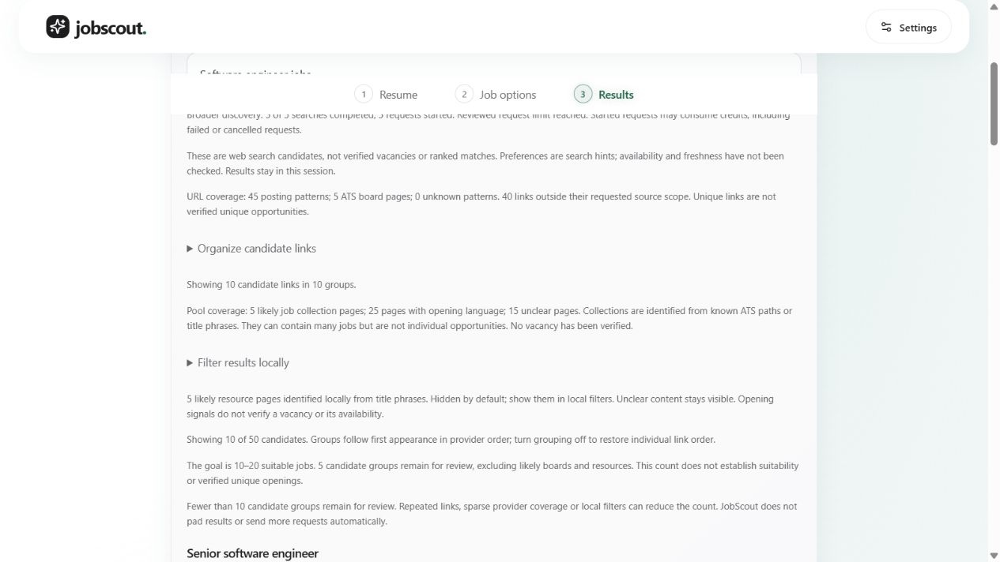
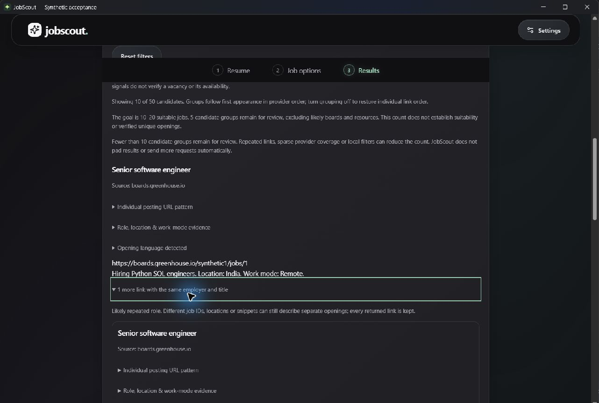
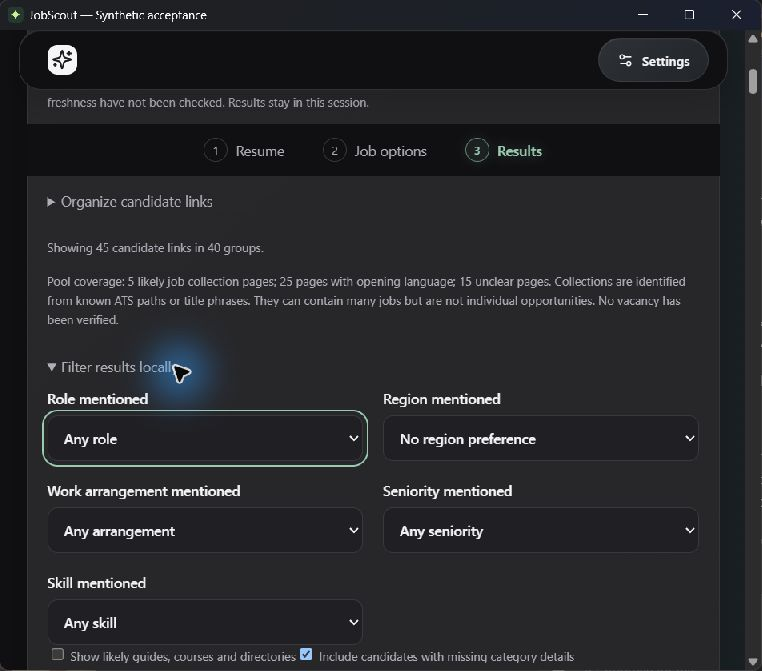
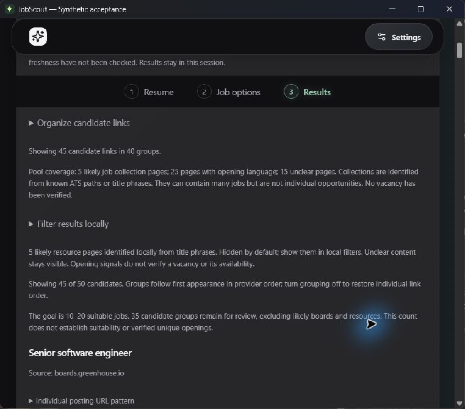
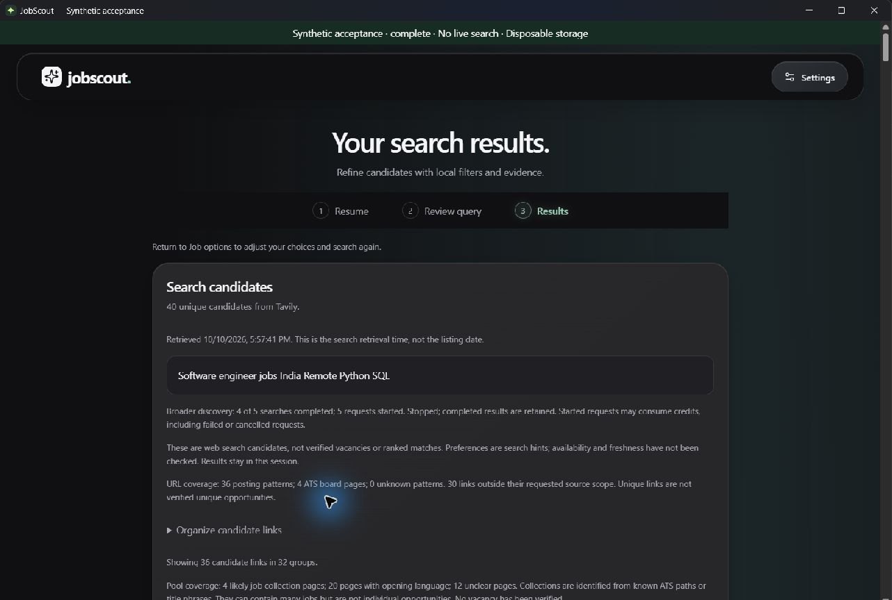
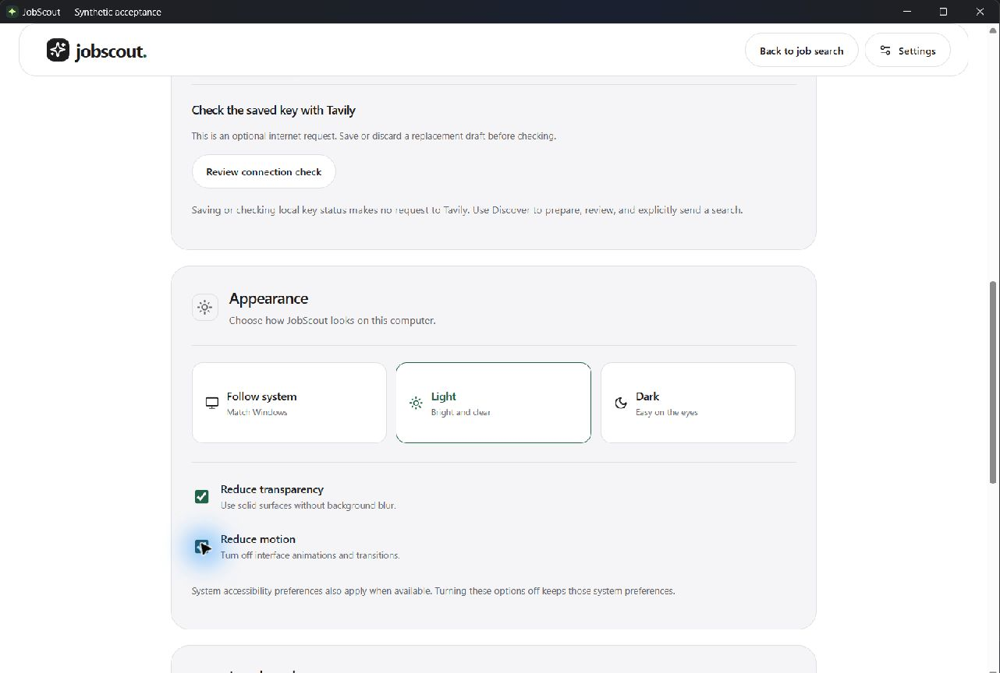
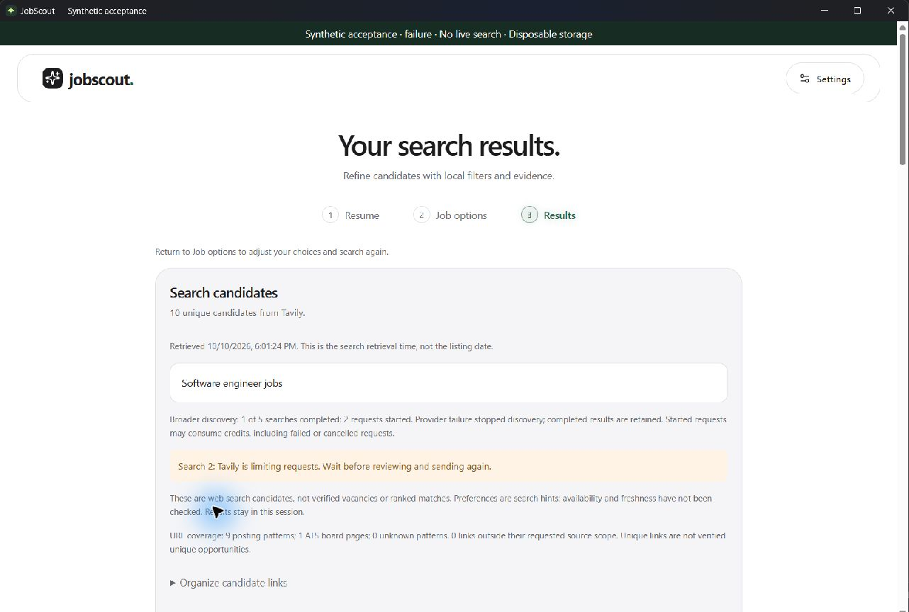
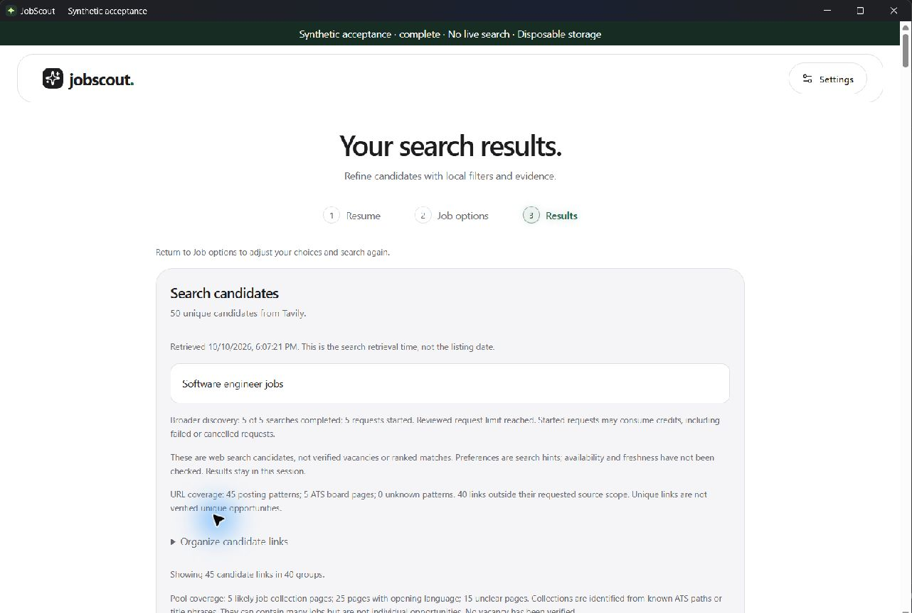

# Milestone 17 acceptance — updated 2026-10-11

Overall status: **partial**. Historical review, bounded resources, browser interaction, native development and isolated installed production-code subsets, and one approved live trial have evidence. Suitable opportunity coverage, full installed/fresh-user interaction and full native accessibility acceptance are not established. Release scope now follows [the v1.0 plan](releases.md).

Latest quality continuation (2026-10-11): [bounded work requirement notes](architecture/0030-work-requirement-review-notes.md) identify five candidates in the same 47-link saved pool: two schedule, one physical-location, one authorization and one unavailable-sponsorship case. All 47 links, 33 selected default groups and two strict/joint-support groups remain; one joint-support group has a physical-location note. Exact clauses appear separately in manual/assisted Results without eligibility inference, filter/ranking or coverage changes. All 104 frontend checks, four harness isolation/privacy checks and nine pools (72/72 reviewable labels) pass. Browser keyboard/compact disclosure and repeated-alternative checks pass for a mock fixture; the new disclosure still lacks native/installed acceptance. No provider/page/vault request; original approval stays consumed.

Latest installed continuation (2026-10-11): [separate-identity release installer](installed-acceptance.md) with unchanged production UI/Rust/engine passes empty first use, manual/synthetic assisted query review, explicit UI profile save, restart, three normal closes and uninstall/cleanup. Normal profile fingerprints and production artifacts unchanged; no provider request/key configuration. Installed test files 32.97 MiB; three ten-process snapshots are bounded observations. This is not the exact normal-identity installer, fresh Windows account, active-work exit, genuine upgrade or peak-resource acceptance. Earlier blanket installed-pending statements below describe earlier checkpoints.

Latest offline correction (2026-10-11): bounded ATS title forms and a local software-development-engineer alias now recognize two joint role/India/remote groups in the same saved 47-link pool, up from zero. All 47 links remain; selected default filters still show 33 reviewable groups; strict mode keeps two. First-ten joint support remains zero. Mixed timezone language still requires review; suitability/freshness are not established. All 333 engine and 97 frontend checks, nine synthetic pools retaining 72/72 reviewable labels and clean-pool evaluation pass. See [decision 0029](architecture/0029-bounded-ats-title-evidence.md). No new provider/page request or installed/native interaction in this correction.

Latest live continuation: one approved five-source run completed in 15.398 seconds, retaining 47 unique links. Nine board shapes; selected role/India/remote filtering leaves 33 reviewable groups but zero recognized joint-support groups. Strict filtering leaves zero. No retry/page fetch/profile load; actual billing and live UI/resources unverified. 94 mocked discovery/adapter checks pass. Approval consumed. See [aggregate evidence and next bounded title-rule correction](17d-live-results-2026-10-10.md); earlier awaiting-approval/no-new-request statements below describe their historical subsets.

Current quality target (user revision, 2026-10-10): **10–20 suitable unique opportunities**. The raw discovery budget remains separate. Results report reviewable groups with a ten-group lower threshold; boards/resources and repeated links cannot inflate this count. Candidate counts remain unverified. Offline historical review still has just one group supporting the selected role/India/remote evidence, below the revised minimum. See [decision 0027](architecture/0027-ten-to-twenty-shortlist.md).

Target implementation evidence: all 94 frontend tests, nine synthetic pools (72/72 reviewable labels retained), clean-pool evaluation, production build/typecheck and paired Windows package pass (22.12 MiB). Rebuilt-package silent install/reinstall/uninstall passes with one existing profile database unchanged; installed files total 34,565,020 bytes (32.96 MiB). Prior 331 engine tests remain applicable to the unchanged engine. Browser mock run retains all fifty links: 35 reviewable groups remain regardless of grouping display. Local role/India/remote/SQL filters leave ten displayed links but five reviewable repeated-role groups, triggering the below-ten message. Reset restores 35 reviewable groups. No live provider or page request. Changes local/unpublished.



| Check | Evidence | Status |
|---|---|---|
| Lossless historical replay | All 49 links retained in 41 unfiltered groups; source provenance explicitly reconstructed | Pass, offline only |
| Role/India/remote evidence | Five boards hidden; 31 surviving links/groups; only one supports all three; first ten have ten role/two region/two remote supports | Coverage shortfall; not 10–20 suitable opportunities |
| Contradictions versus unknowns | Ten disjoint remote-area links identified; overlapping geography, sparse snippets and conflicts retained conservatively | Pass for bounded rules |
| Work requirements beyond role/location/remote | Bounded literal-source notes flag five saved candidates, including one joint-support group; questions/prose/boards suppressed; filters/order/coverage unchanged; browser keyboard/compact repeated alternatives pass | Pass for bounded extraction/disclosure subset; non-exhaustive, not eligibility or suitable-job verification |
| ATS title correction on the saved live envelope | Whole-term local role alias, application-title India suffix and 100%-remote area metadata; joint support/strict survivors 0 → 2, all 47 unfiltered links and 33 selected default groups retained | Pass for bounded extraction; suitable coverage remains unmet |
| Synthetic retention and privacy boundaries | 72/72 reviewable labels across nine pools, clean-pool evaluation, 97 frontend tests and 333 engine checks including paired title evidence and alias captured-request privacy | Pass; not live vacancy verification |
| Current Windows bundle | Paired local title-evidence engine/frontend rebuild, Rust release and NSIS package pass: 23,191,627 bytes / 22.12 MiB | Package pass; changed package installed acceptance pending |
| Previous package silent install/reinstall/uninstall | Earlier package: clean per-user test destination, exact NSIS payload, same-version reinstall, one existing profile database unchanged, app files/uninstall entry removed; 32.96 MiB installed footprint | Prior silent subset pass; changed package needs installed acceptance |
| Isolated installed release first use/save/restart/normal close | Production code under separate identity, empty test vault/data, manual/assisted public query, explicit local UI save and restart; three closes leave zero owned processes; uninstall/cleanup and normal-profile preservation pass; 32.97 MiB | Pass for bounded installed subset; normal identity/fresh OS/active-work/upgrade pending |
| Engine startup/idle/import resources | Three launches per DOCX, PDF and local-analysis fixture; within existing provisional thresholds | Pass for measured fixtures |
| Engine responsiveness during slow discovery | Nine fresh synthetic HTTP runs; health/progress maximum 25.31/17.73 ms; cancel-to-retained-results 4.84–9.37 ms | Pass for development mock fixture; native/live pending |
| Packaged native initial-view resources | Initial UI tree measured without UI input; owner termination leaves zero owned descendants | Historical packaged subset; excludes Results/import peaks and normal UI close |
| Native development Results snapshot and normal/active-work close | Isolated Rust/WebView shell with frozen mock sidecar; ten owned processes, forty-candidate Results snapshot 628.07 MiB working set / 465.49 MiB private commitment; normal and active-search closure leave zero owned processes | Pass for mock development lifecycle; snapshot is not production peak RAM |
| Reviewed broader preview/single opt-out/progress/stop/partial recovery | Browser and native mock UI: complete 50-link runs; browser stop retains 20 after 2 completed/3 started, native stop retains 40 after 4 completed/5 started; rate limit retains 10 after 1 completed/2 started; deliberate single retry returns 10 | Pass for bounded browser/native development mock subset |
| Keyboard grouping/filter/reset/retry | Browser checks and prior native retry; native Tab/Shift+Tab, Enter and Space exercise organization, role/region/work-mode/SQL filters, unknown retention, reset, resources, boards, grouping and repeated alternatives | Pass for bounded mock Results subset; full accessibility audit pending |
| Light/Dark/System, compact sizes, focus and opaque fallbacks | Prior browser/native theme and reduction evidence; native 760 × 640 content-size landing/preferences/query/Results inspection, visible filter focus and keyboard organization controls | Bounded browser/native visual subset pass; OS propagation, forced colors, complete contrast and screen-reader audit pending |
| Fresh-user installer wizard, version upgrade and full installed lifecycle | Earlier silent package and native mock checks; isolated installed production-code first-use/save/restart/normal-close/uninstall subset passes | Wizard/fresh Windows user/version upgrade/installed active-work and abrupt exit pending |
| Bounded live quality/latency | Approved five-source run: 47 links, 33 selected reviewable groups, zero recognized joint-support groups; 15.398 s, five-credit estimated ceiling, no retry/page fetch | Trial complete; suitable-evidence shortfall |
| Representative live relevance, freshness, billing and search/Results peak RAM | One narrow direct-adapter trial; no page verification, account usage check or installed live UI/resource measurement | Pending beyond the bounded trial |

## Remaining 17D slices

Keep these separate, bounded acceptance sessions rather than one broad completion claim. The title-evidence correction is complete for its narrow scope; it does not close the quality gate.

| Slice | Challenge | Next evidence |
|---|---|---|
| Quality and coverage | Bounded work-requirement notes now expose five explicit cases; sparse/contradictory text, unsupported wording and one-query sampling remain; two joint-support groups do not establish ten suitable jobs | Independently reviewed representative cases and source-coverage evaluation; preserve unknowns and honest shortfalls. Additional online evidence needs its own exact review |
| Installed Windows behavior | Separate-identity installed first-use/restart/normal-close subset passes; normal wizard, fresh Windows account, upgrade and active-work/abrupt exit remain | Separately scoped installed active-work test, normal wizard/fresh account and genuine upgrade evidence when an earlier version is available |
| Full accessibility and OS behavior | Existing keyboard/compact/theme checks cover only a subset | Screen-reader, complete keyboard/contrast, forced colors and OS preference propagation with readable reduced effects |
| Production resources | Mock timings and one debug snapshot omit shipped search/Results peaks | Reproducible packaged resource measurements with synthetic data; separate initial-view, import/search/Results peaks and hardware limits |

Current paired engine/frontend/Rust/NSIS rebuild passes (23,191,627 bytes / 22.12 MiB). Restricted Tauri packaging hit access denial reading generated dist; scoped permission completed the same package with no ACL change. The subsequent separate-identity installed subset uses that production engine and frontend/Rust source, with normal production artifact hashes preserved. Earlier normal-package footprint/lifecycle evidence remains specific to its measured binary; build success alone does not establish installed acceptance.

## Interactive continuation

### Native Results keyboard and compact continuation — 2026-10-10

Two fresh native mock runs each complete all five searches and retain fifty synthetic links. Default Results show 45 links in forty display groups and 35 reviewable groups. With keyboard local filters, software engineer leaves forty links, India leaves 35, and remote retains 35. SQL leaves 25 links in twenty display groups with fifteen reviewable groups while missing category details remain included. Space disables unknown retention: ten links remain in five repeated-role groups, and the below-ten guidance appears. Re-enabling unknown retention restores 25 links; Tab then Enter on Reset filters restores 45 visible links and 35 reviewable groups. Showing resources with Space restores all fifty links while reviewable coverage stays 35. Enter collapses/reopens a repeated-role alternative and reveals its separate link/snippet; visible focus is inspected.

Added a development-only `--compact` option to the existing native launcher for reproducible checks at the production minimum content size, 760 × 640. Native Dark landing, public preferences, five-source query disclosure, Results and filter controls remain readable within the captured width, with vertical scrolling to lower actions. Tab reaches the role filter with a visible focus border. Keyboard organization expansion, grouping opt-out and board hiding work: grouping off keeps 45 links in 45 display groups; hiding five boards leaves forty links. Independent reviewable coverage stays 35 throughout. This is a bounded visual/keyboard check, not a complete focus-order, zoom, contrast, screen-reader, OS-preference or forced-color audit. No production UI fix was needed.

The initial restricted launch could not reach its loopback preview server; the same isolated launcher ran with scoped process permission. After scrolling, some accessibility element bounds were stale despite current text; inputs used freshly captured screenshots or keyboard navigation. Neither tooling limitation is evidence of a product failure. Both windows were closed normally, both launchers exit successfully and each newly inventoried temporary database directory is removed. The compact app/sidecar/WebView process inventory has zero surviving owned processes. Older interrupted preview folders remain untouched. No new resource peak, installed production launch, live provider/page request, credential operation or publication.

Validation: mock sidecar packaging and both native development launches pass; compact config triggers a successful Rust rebuild. Launcher syntax and diff whitespace checks pass. Production engine/frontend behavior is unchanged, so prior 332 engine checks, 94 frontend checks, nine synthetic pools, production build/typecheck, paired release package and silent-install evidence remain applicable; those suites were not rerun for this harness/documentation slice. Six synthetic screenshots record the keyboard alternative and compact landing/preferences/query/Results/focus views. Work remains local/unpublished.





Next: installed interactive acceptance and remaining full accessibility/OS checks, plus fresh approval of the bounded live-quality plan. Overall 17D remains partial; the historical suitable-opportunity evidence still supports only one role/India/remote group.

### Native development acceptance — 2026-10-10

Supported Windows controls initialize through the Computer Use plugin. Added `npm run acceptance:native` (also `-- failure`), an isolated launcher using the production Rust shell, WebView UI and a separately frozen mock sidecar. Its ignored Tauri override uses a separate test application identifier, port 1422 and existing ignored dev cache. Production config, release binaries, provider behavior and dependencies are unchanged. The sidecar discards the shell's supplied storage path and creates a fresh temporary database; it never opens the real credential vault or model runtime. Both search and account transports remain injected mocks. See [reproduction](acceptance-preview.md#windows-native-harness).

Native DOCX selection/extraction yielded editable synthetic review text. Assisted suggestions showed `Software engineer jobs Python SQL`; keyboard public-region/arrangement changes regenerated `Software engineer jobs India Remote Python SQL`. Distinctive private fixture markers stayed out of the displayed queries. All five fixed queries/domain scopes appeared before dispatch. The manual path separately prepared `Software engineer jobs`. These are native UI observations; captured mock-request regression checks establish outbound omission and fixed scopes.

The assisted run exposed progress/stop and retained forty candidates from four completed/five started requests. Defaults displayed 36 links in 32 groups; disabling displayed grouping retained 36 links in 36 display groups while the independent reviewable coverage stayed 28. The partial-failure run retained ten after one completed/two started requests with rate-limit guidance. Returning to preferences, preparing again, explicitly opting out of broader discovery and sending returned ten fresh candidates. A final manual complete run retained fifty candidates after five completed/five started requests: 45 default-visible links, forty display groups and 35 reviewable groups. None of these counts establishes suitable unique vacancies.

Light, the current system-followed Dark appearance and both manual reductions were inspected in the native WebView. Checked reductions and Light survived native restart. The test app restarted with a fresh database and no imported document/results. Restored Follow system and both manual reductions off. Native controls expose named accessibility elements; keyboard region/arrangement selection works. This is not a full keyboard, contrast, screen-reader, compact-window, forced-color or OS-preference-change audit.

Normal Results close and close during an active mock search each stopped all ten app-owned processes; launchers also exited. Final normal close checked process ID plus creation time and removed its newly observed temporary database directory. Older interrupted browser-harness folders predated these native runs and were left untouched. The forty-candidate Results process-tree snapshot was 628.07 MiB summed working set / 465.49 MiB private commitment. It uses a debug shell and frozen mock sidecar; shared working sets can double-count pages, and one snapshot does not measure peaks or production/live performance. Installed production launch and lifecycle remain unverified.

Validation: all 332 engine checks pass, including a new regression that proves the native wrapper ignores the supplied personal-data directory and rejects live options/scenarios and fixed non-random ports. Synthetic sidecar packaging and native Rust development build pass. Prior 94 frontend checks, target evaluation, production build/typecheck, paired release packaging and silent install evidence remain applicable; no production code changed in this native harness increment. Four native synthetic screenshots are recorded. No live provider/job-page request, real document, credential operation, installer action or publication.






The later native Results keyboard/compact continuation above supersedes this subset's next action. Installed interactive acceptance and a freshly approved [bounded live plan](17d-live-review.md) remain pending. Overall 17D stays partial.

### Silent installer continuation

Current package install/reinstall/uninstall passes using the scoped [installer check](installation-checks.md). The final harness verifies the exact installed engine and desktop payload (accounting only for Tauri's NSIS bundle marker), correct registration, unchanged existing profile database, application directory/uninstall-entry removal and restored remembered test destination. Installed application files including uninstaller total 34,562,914 bytes (32.96 MiB). No application launch, shortcut creation, credential operation, optional app-data deletion or provider call. This silent check narrows the installer gap without establishing interactive wizard, installed normal close/active-work exit or a genuine version upgrade. The later native development mock checks above provide separate lifecycle evidence.

The next live quality run is [prepared for explicit review](17d-live-review.md), not dispatched. Its public query/source scopes, five-credit ceiling, seventy-five-second limit and retention/privacy rules are concrete; no historical authorization is reused.

### Storage and responsiveness continuation

The reproducible `scripts/measure-discovery.py` exercises authenticated production routes over real loopback HTTP with injected mock providers and fresh temporary storage. Three runs per scenario retain 50 links after five completed requests, or ten after one completed/two attempted requests on cancellation and rate limiting. No later dispatch occurs after stopping or failure. Health request medians range 4.63–7.92 ms (maximum 25.31 ms); progress medians 3.03–6.16 ms (maximum 17.73 ms). Cancel acknowledgement takes 3.28–6.01 ms and retained results arrive 4.84–9.37 ms after the cancellation request starts. Timing includes HTTP response reading and scheduling, with no polling pause added to cancellation timing. One-second mock waits dominate complete-run duration (5.052–5.136 s). Build activity overlapped the measurements; these are observations, not latency guarantees.

The first run exposed SQLite handles remaining open after transaction contexts, preventing Windows temporary-database cleanup. Storage operations now explicitly close connections after commit/rollback instead of relying on garbage collection. New regression checks retain connection references and verify closure, persisted save/delete behavior and rollback after a failed write. All 331 engine tests pass; paired production engine/Rust/NSIS packaging passes (22.11 MiB). No schema, data location, retention policy, credential or outbound-contract change. All nine final benchmark directories clean up successfully. The development client/server share one event loop; no packaged/native UI, RAM, installer lifecycle, live-provider latency or billing claim follows.

The 2026-10-08 automation attempts failed before app input. On 2026-10-10 the supported in-app browser initialized successfully. The synthetic preview required scoped process permission because sandbox localhost/ASGI access was blocked; the permission was approved. No ACL changes or automation-boundary bypass. Native controls were disabled in that browser interface, so this earlier subset attempted no native input. The supported Windows plugin subsequently initialized for the isolated native continuation above. Silent installation still does not establish interactive wizard acceptance.

### Browser evidence — 2026-10-10

Added the [repeatable acceptance preview](acceptance-preview.md): production UI and engine, injected mock search/account transports, offline model status, in-memory synthetic key, fresh temporary storage, visible test banner and separate localhost port. No production entry-point/runtime behavior, model, dependency or storage migration changed. Harness tests verify real-vault isolation, private-marker omission, bounded complete/failure dispatch and refusal of real replacement keys. No live provider, job page or embedded resource was fetched by this continuation.

Manual and assisted paths were exercised. A synthetic DOCX containing distinctive private markers extracted into editable review. Local suggestions produced `Software engineer jobs Python SQL`; reviewed region/work-mode edits invalidated the old preview and produced `Software engineer jobs India Remote Python SQL`. Private markers were absent from those displayed queries. All five source scopes were displayed; the separate single-search option disclosed one request and returned ten candidates. Local result analysis and shared-skill ordering appeared in the assisted path.

The slower mock made progress/stop observable: 2/5 completed, 3 started, then 20 retained candidates with explicit stopped coverage. A complete run returned 50. The failure scenario stopped at 1/5 completed, 2 started, retained ten candidates and showed rate-limit guidance. No automatic retry is implemented; captured harness tests establish the two-request ceiling after failure. Returning to options and explicitly retrying single-search recovery was exercised.

On the 20-link cancelled pool, default resource hiding left 18 links in 16 groups. Role/India/remote filtering with boards hidden left 12 links in 10 groups, retaining unknown/conflict details and excluding explicit wrong-role/location evidence. Strict mode left six links in four groups. Enter expanded a repeated-role alternative; reset and grouping opt-out restored 18 individually displayed links. Malicious HTML-like titles/snippets appeared literally. Settings deliberately clears query/results before provider configuration; the browser displayed the resulting search-again guidance.

Light/Dark and compact/wide views were inspected; controls/text remained readable. The compact query document width was 625 px at a 640 px viewport. Follow system was restored and its pressed preference verified after reload. This is a bounded visual/interaction check, not a complete contrast, screen-reader or keyboard audit. Reduced motion, reduced transparency, forced colors, OS theme propagation and native controls remain unverified.


Validation: 329 engine tests, 88 frontend tests, nine synthetic relevance pools and clean-pool evaluation, production build/typecheck pass. Production UI/engine behavior is unchanged, so the 2026-10-08 packaging/resources remain historical evidence; no new installed/native-resource claim. Changes are local/unpublished.

Explicit single-search retry after the partial failure completed with ten fresh candidates; Clear results then displayed search-again guidance. Preview shutdown left zero matching acceptance engine/launcher/Vite processes. This confirms test-harness cleanup only, not the native lifecycle gate.

### Accessibility fallback implementation — 2026-10-10

Added independent Reduce transparency and Reduce motion controls in Appearance, so users can request readable solid surfaces and remove interface motion when the webview does not expose OS preferences. Both default off and are remembered locally alongside the theme. A startup script applies saved choices before first paint; storage failures fall back safely, and blocked writes retain session state. Disabled manual choices do not override existing system media rules. Forced-color precedence and selected-theme borders are preserved. No network/API/engine, credential, career-data or dependency change.

Browser verification: Space toggled both named native checkboxes with visible focus. Enabled reductions yielded `backdrop-filter: none`, no panel background image, opaque light/dark panel colors and zero transition duration. The selected theme retained its accent border. Reload preserved both checked states and Dark; a second window inherited them and changing only transparency synchronized to the first while motion stayed reduced. Disabling motion restored the normal 0.12-second transitions. Compact view remained within 640 px (document width 625 px). With both enabled, discovery exposed text progress and stop controls; cancellation retained 30 candidates from three completed/four started requests. These are synthetic candidates, not a suitable-opportunity coverage claim.


Validation for this implementation: all 90 frontend tests pass (two new pre-paint stored/malformed/unavailable-preference checks), production build/typecheck and paired Windows engine/Rust/NSIS packaging pass (22.12 MiB). Earlier engine/evaluation checks remain applicable; engine and ranking are unchanged. Restored Follow system and both manual controls off, reset viewport and closed synthetic tabs. Native rendering, OS preference propagation, forced colors and full keyboard/screen-reader audit remain pending. No installer execution, live provider call or new RAM/startup measurement. Work local/unpublished.

When supported controls are available, use an isolated synthetic workspace and a dispatch-disabled provider harness. Exercise manual and resume paths, query edits/invalidation, every displayed fixed source scope, single opt-out, progress, stop with completed results, provider failure and retry. Verify no hidden provider retry or personal fields. In Results, expand every repeated-role alternative, select role/region/arrangement filters, compare unknown/conflict handling, enable strict mode, reset, clear and navigate back. Check keyboard focus, readable contrast, both themes/System, compact and wide windows, reduced motion and opaque fallback. Capture synthetic screenshots when possible. Repeat normal native close, active-work close and restart, inspecting only app-owned descendants.

The exact live trial was approved and completed once; that approval is consumed. Further trials require a fresh explicit review of query/source/spending bounds. The subsequent offline title-evidence correction/replay is complete for its bounded scope. Next are installed/full accessibility acceptance and evaluation of remaining coverage/restriction uncertainty. Do not start saving/tracking or optional AI on the assumption that candidate count meets the shortlist gate.

## Reproduce the completed subset

```powershell
node --experimental-strip-types --test apps/desktop/tests/*.test.mjs
.venv\Scripts\python.exe -m pytest -p no:cacheprovider --basetemp=.local/pytest-acceptance
npm run evaluate:shortlist
npm run desktop:build
powershell.exe -NoProfile -ExecutionPolicy Bypass -File scripts/check-installer.ps1
pwsh -NoProfile -File scripts/measure-engine.ps1 -Runs 3 -Format shortlist
pwsh -NoProfile -File scripts/measure-engine.ps1 -Runs 3 -Format docx
pwsh -NoProfile -File scripts/measure-engine.ps1 -Runs 3 -Format pdf
pwsh -NoProfile -File scripts/measure-desktop.ps1
```

Historical replay requires an explicit locally saved public result envelope:

```powershell
node --experimental-strip-types scripts/review-historical-pool.mjs <local-public-result.json> 9,10,10,10,10
```

Only supply source counts for the historical pre-provenance response when those source blocks are established. Current responses already carry provenance; omit the counts argument. The native process benchmark opens the initial UI in its existing workspace without input, then terminates only the process it started. It refuses to run when another JobScout process exists. It performs no search or record operation; existing data is retained. Engine benchmarks use fresh isolated storage with synthetic inputs. Neither script installs, upgrades or uninstalls anything.
