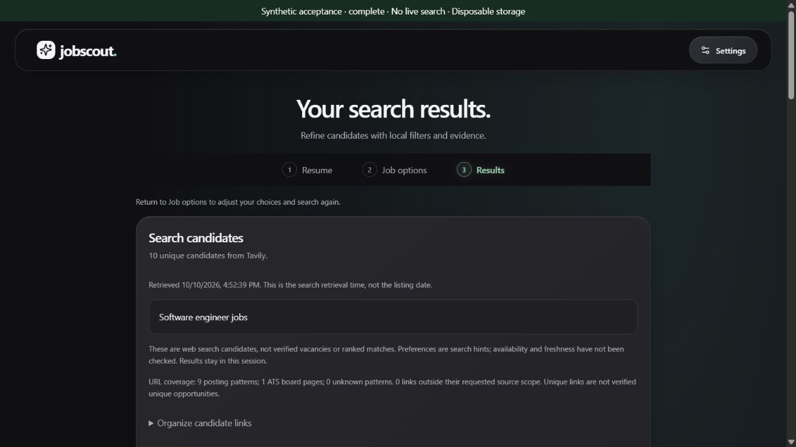
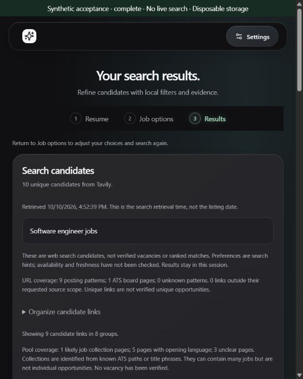
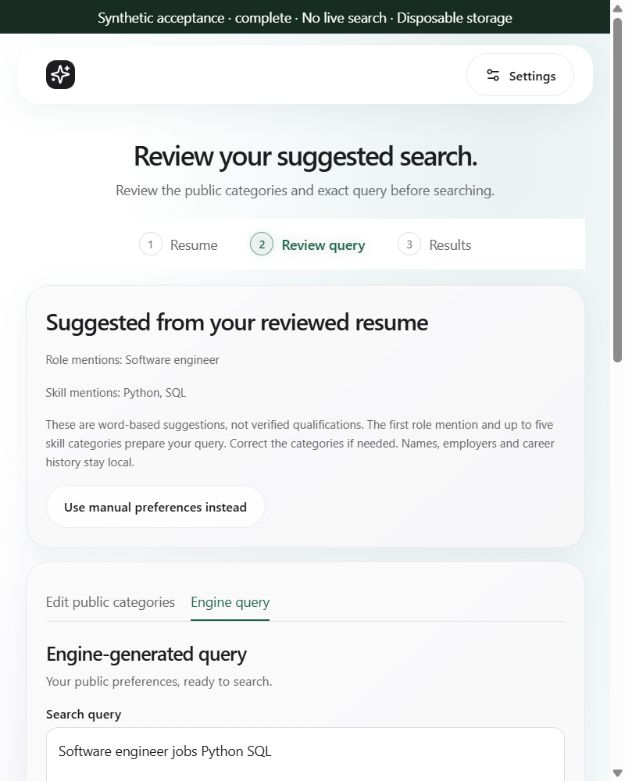
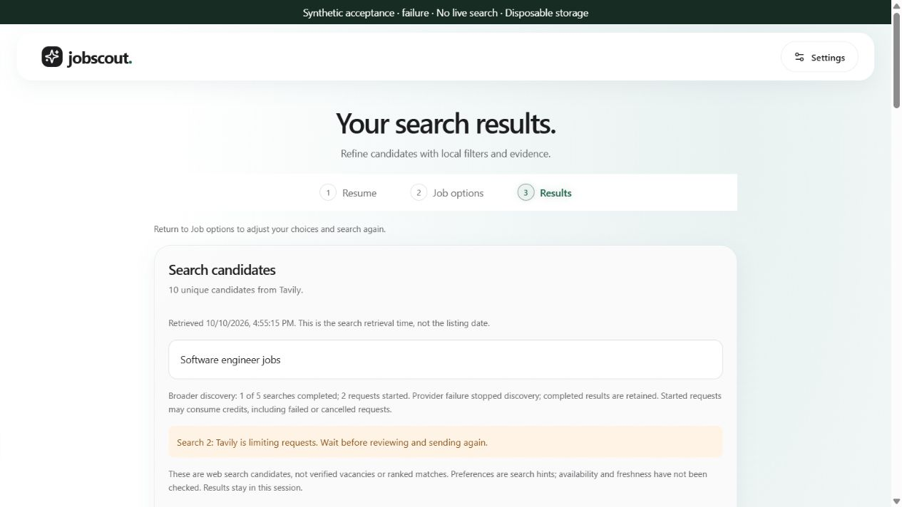
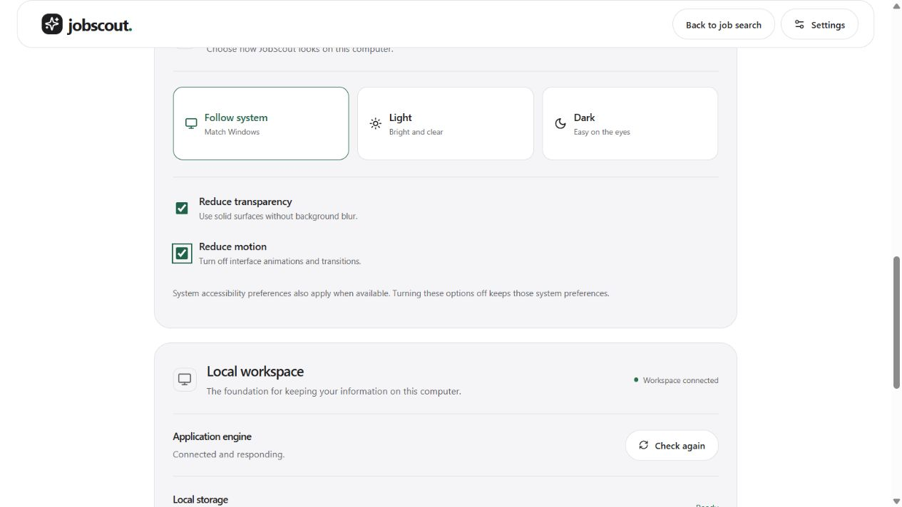
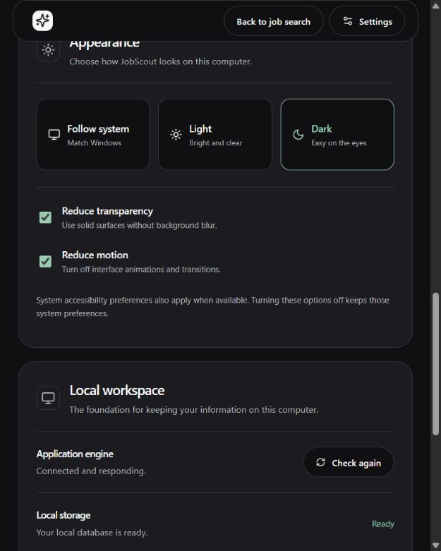

# Milestone 17 acceptance — 2026-10-10

Overall status: **partial**. Historical review, bounded resources and the browser synthetic interaction subset have evidence. Suitable opportunity coverage and native acceptance are not established.

| Check | Evidence | Status |
|---|---|---|
| Lossless historical replay | All 49 links retained in 41 unfiltered groups; source provenance explicitly reconstructed | Pass, offline only |
| Role/India/remote evidence | Five boards hidden; 31 surviving links/groups; only one supports all three; first ten have ten role/two region/two remote supports | Coverage shortfall; not 30–50 suitable opportunities |
| Contradictions versus unknowns | Ten disjoint remote-area links identified; overlapping geography, sparse snippets and conflicts retained conservatively | Pass for bounded rules |
| Synthetic retention and privacy boundaries | 72/72 reviewable labels across nine pools, clean-pool evaluation, 90 frontend tests; prior 329 engine checks including the acceptance harness remain applicable to the unchanged engine | Pass; not live vacancy verification |
| Current Windows bundle | Accessibility controls, SQLite connection cleanup, Rust shell and paired Python sidecar produce 22.11 MiB NSIS installer; silent install payload verified | Pass; interactive installer pending |
| Current silent install/reinstall/uninstall | Clean per-user test destination, exact NSIS payload, same-version reinstall, one existing profile database unchanged, app files/uninstall entry removed; 32.96 MiB installed footprint | Pass for silent subset; no installed launch |
| Engine startup/idle/import resources | Three launches per DOCX, PDF and local-analysis fixture; within existing provisional thresholds | Pass for measured fixtures |
| Engine responsiveness during slow discovery | Nine fresh synthetic HTTP runs; health/progress maximum 25.31/17.73 ms; cancel-to-retained-results 4.84–9.37 ms | Pass for development mock fixture; native/live pending |
| Full native process resources | Initial UI tree measured without UI input; owner termination leaves zero owned descendants | Measured; excludes Results/import peaks and normal UI close |
| Reviewed broader preview/single opt-out/progress/stop/partial recovery | Real browser UI/local engine with mocked transport: complete 50-link run; stop retains 20 links after 2 completed/3 started; rate limit retains 10 after 1 completed/2 started; single request returns 10 | Browser subset pass; native pending |
| Keyboard grouping/filter/reset/retry | Enter expands filters and repeated-role alternative; strict mode reduces 12→6 links; reset and grouping opt-out restore 18 default-visible links from 20; explicit retry checked | Browser subset pass; full keyboard/native pending |
| Light/Dark/System, compact sizes, focus and opaque fallbacks | Manual Reduce transparency/motion controls verified with computed styles, keyboard toggles, reload and cross-window sync; Light/Dark/compact views and persisted System preference checked | Browser subset pass; OS preference propagation/forced colors/full accessibility and native pending |
| Fresh-user installer wizard, version upgrade and normal-close lifecycle | Current silent package check passes; prior normal-close checks remain historical | Pending for interactive/fresh-user/version/lifecycle gates |
| Representative live relevance, freshness, billing and search/Results peak RAM | No new provider request, page retrieval or live UI search in this continuation | Pending |

## Interactive continuation

### Silent installer continuation

Current package install/reinstall/uninstall passes using the scoped [installer check](installation-checks.md). The final harness verifies the exact installed engine and desktop payload (accounting only for Tauri's NSIS bundle marker), correct registration, unchanged existing profile database, application directory/uninstall-entry removal and restored remembered test destination. Installed application files including uninstaller total 34,562,914 bytes (32.96 MiB). No application launch, shortcut creation, credential operation, optional app-data deletion or provider call. Native controls remain unavailable, so this narrows the installer gap without establishing interactive wizard, normal close, active-work exit or a genuine version upgrade.

The next live quality run is [prepared for explicit review](17d-live-review.md), not dispatched. Its public query/source scopes, five-credit ceiling, seventy-five-second limit and retention/privacy rules are concrete; no historical authorization is reused.

### Storage and responsiveness continuation

The reproducible `scripts/measure-discovery.py` exercises authenticated production routes over real loopback HTTP with injected mock providers and fresh temporary storage. Three runs per scenario retain 50 links after five completed requests, or ten after one completed/two attempted requests on cancellation and rate limiting. No later dispatch occurs after stopping or failure. Health request medians range 4.63–7.92 ms (maximum 25.31 ms); progress medians 3.03–6.16 ms (maximum 17.73 ms). Cancel acknowledgement takes 3.28–6.01 ms and retained results arrive 4.84–9.37 ms after the cancellation request starts. Timing includes HTTP response reading and scheduling, with no polling pause added to cancellation timing. One-second mock waits dominate complete-run duration (5.052–5.136 s). Build activity overlapped the measurements; these are observations, not latency guarantees.

The first run exposed SQLite handles remaining open after transaction contexts, preventing Windows temporary-database cleanup. Storage operations now explicitly close connections after commit/rollback instead of relying on garbage collection. New regression checks retain connection references and verify closure, persisted save/delete behavior and rollback after a failed write. All 331 engine tests pass; paired production engine/Rust/NSIS packaging passes (22.11 MiB). No schema, data location, retention policy, credential or outbound-contract change. All nine final benchmark directories clean up successfully. The development client/server share one event loop; no packaged/native UI, RAM, installer lifecycle, live-provider latency or billing claim follows.

The 2026-10-08 automation attempts failed before app input. On 2026-10-10 the supported in-app browser initialized successfully. The synthetic preview required scoped process permission because sandbox localhost/ASGI access was blocked; the permission was approved. No ACL changes or automation-boundary bypass. Native controls are disabled in the available interface, so no native input was attempted. The later silent installer continuation above uses the package command-line interface and does not establish interactive wizard acceptance.

### Browser evidence — 2026-10-10

Added the [repeatable acceptance preview](acceptance-preview.md): production UI and engine, injected mock search/account transports, offline model status, in-memory synthetic key, fresh temporary storage, visible test banner and separate localhost port. No production entry-point/runtime behavior, model, dependency or storage migration changed. Harness tests verify real-vault isolation, private-marker omission, bounded complete/failure dispatch and refusal of real replacement keys. No live provider, job page or embedded resource was fetched by this continuation.

Manual and assisted paths were exercised. A synthetic DOCX containing distinctive private markers extracted into editable review. Local suggestions produced `Software engineer jobs Python SQL`; reviewed region/work-mode edits invalidated the old preview and produced `Software engineer jobs India Remote Python SQL`. Private markers were absent from those displayed queries. All five source scopes were displayed; the separate single-search option disclosed one request and returned ten candidates. Local result analysis and shared-skill ordering appeared in the assisted path.

The slower mock made progress/stop observable: 2/5 completed, 3 started, then 20 retained candidates with explicit stopped coverage. A complete run returned 50. The failure scenario stopped at 1/5 completed, 2 started, retained ten candidates and showed rate-limit guidance. No automatic retry is implemented; captured harness tests establish the two-request ceiling after failure. Returning to options and explicitly retrying single-search recovery was exercised.

On the 20-link cancelled pool, default resource hiding left 18 links in 16 groups. Role/India/remote filtering with boards hidden left 12 links in 10 groups, retaining unknown/conflict details and excluding explicit wrong-role/location evidence. Strict mode left six links in four groups. Enter expanded a repeated-role alternative; reset and grouping opt-out restored 18 individually displayed links. Malicious HTML-like titles/snippets appeared literally. Settings deliberately clears query/results before provider configuration; the browser displayed the resulting search-again guidance.

Light/Dark and compact/wide views were inspected; controls/text remained readable. The compact query document width was 625 px at a 640 px viewport. Follow system was restored and its pressed preference verified after reload. This is a bounded visual/interaction check, not a complete contrast, screen-reader or keyboard audit. Reduced motion, reduced transparency, forced colors, OS theme propagation and native controls remain unverified.






Validation: 329 engine tests, 88 frontend tests, nine synthetic relevance pools and clean-pool evaluation, production build/typecheck pass. Production UI/engine behavior is unchanged, so the 2026-10-08 packaging/resources remain historical evidence; no new installed/native-resource claim. Changes are local/unpublished.

Explicit single-search retry after the partial failure completed with ten fresh candidates; Clear results then displayed search-again guidance. Preview shutdown left zero matching acceptance engine/launcher/Vite processes. This confirms test-harness cleanup only, not the native lifecycle gate.

### Accessibility fallback implementation — 2026-10-10

Added independent Reduce transparency and Reduce motion controls in Appearance, so users can request readable solid surfaces and remove interface motion when the webview does not expose OS preferences. Both default off and are remembered locally alongside the theme. A startup script applies saved choices before first paint; storage failures fall back safely, and blocked writes retain session state. Disabled manual choices do not override existing system media rules. Forced-color precedence and selected-theme borders are preserved. No network/API/engine, credential, career-data or dependency change.

Browser verification: Space toggled both named native checkboxes with visible focus. Enabled reductions yielded `backdrop-filter: none`, no panel background image, opaque light/dark panel colors and zero transition duration. The selected theme retained its accent border. Reload preserved both checked states and Dark; a second window inherited them and changing only transparency synchronized to the first while motion stayed reduced. Disabling motion restored the normal 0.12-second transitions. Compact view remained within 640 px (document width 625 px). With both enabled, discovery exposed text progress and stop controls; cancellation retained 30 candidates from three completed/four started requests. These are synthetic candidates, not a suitable-opportunity coverage claim.




Validation for this implementation: all 90 frontend tests pass (two new pre-paint stored/malformed/unavailable-preference checks), production build/typecheck and paired Windows engine/Rust/NSIS packaging pass (22.12 MiB). Earlier engine/evaluation checks remain applicable; engine and ranking are unchanged. Restored Follow system and both manual controls off, reset viewport and closed synthetic tabs. Native rendering, OS preference propagation, forced colors and full keyboard/screen-reader audit remain pending. No installer execution, live provider call or new RAM/startup measurement. Work local/unpublished.

When supported controls are available, use an isolated synthetic workspace and a dispatch-disabled provider harness. Exercise manual and resume paths, query edits/invalidation, every displayed fixed source scope, single opt-out, progress, stop with completed results, provider failure and retry. Verify no hidden provider retry or personal fields. In Results, expand every repeated-role alternative, select role/region/arrangement filters, compare unknown/conflict handling, enable strict mode, reset, clear and navigate back. Check keyboard focus, readable contrast, both themes/System, compact and wide windows, reduced motion and opaque fallback. Capture synthetic screenshots when possible. Repeat normal native close, active-work close and restart, inspecting only app-owned descendants.

A live trial requires a fresh explicit review of the exact generic query/source plan and spending limit; the historical trial's authorization does not cover a new run. Do not start saving/tracking or optional AI on the assumption that candidate count meets the shortlist gate.

## Reproduce the completed subset

```powershell
node --experimental-strip-types --test apps/desktop/tests/*.test.mjs
.venv\Scripts\python.exe -m pytest -p no:cacheprovider --basetemp=.local/pytest-acceptance
npm run evaluate:shortlist
npm run desktop:build
powershell.exe -NoProfile -ExecutionPolicy Bypass -File scripts/check-installer.ps1
pwsh -NoProfile -File scripts/measure-engine.ps1 -Runs 3 -Format shortlist
pwsh -NoProfile -File scripts/measure-engine.ps1 -Runs 3 -Format docx
pwsh -NoProfile -File scripts/measure-engine.ps1 -Runs 3 -Format pdf
pwsh -NoProfile -File scripts/measure-desktop.ps1
```

Historical replay requires an explicit locally saved public result envelope:

```powershell
node --experimental-strip-types scripts/review-historical-pool.mjs <local-public-result.json> 9,10,10,10,10
```

Only supply source counts for the historical pre-provenance response when those source blocks are established. Current responses already carry provenance; omit the counts argument. The native process benchmark opens the initial UI in its existing workspace without input, then terminates only the process it started. It refuses to run when another JobScout process exists. It performs no search or record operation; existing data is retained. Engine benchmarks use fresh isolated storage with synthetic inputs. Neither script installs, upgrades or uninstalls anything.
