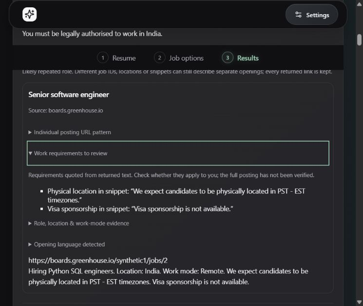

# Progress — 2026-10-11

Session began 2026-10-10 and crossed midnight in Asia/Calcutta. Release planning and the approved provider trial occurred on 2026-10-10; documentation closeout follows here.

## Release scope and 17D live continuation

Adopted [release-based delivery](../releases.md) and [decision 0028](../architecture/0028-release-based-delivery.md). v1.0 includes the model-free Windows core through milestone 23: private resume/manual discovery, useful shortlist evidence, local saving/basic tracking, data controls, guided core setup and hardening. v1.1 groups optional semantic matching (24–26); v1.2 optional local AI (27–30). Mature features receive individual later scopes. Existing milestone identifiers/history remain; old session estimates are historical. Updated README/roadmap/installation design links and boundaries. No deadline, version bump or release publication; actual version remains 0.1.0. Privacy, quality and lifecycle gaps remain blockers.

The user separately approved one exact generic query across five fixed ATS scopes, at most five basic requests/fifty raw candidates/seventy-five seconds/five credits, with no profile/page retrieval/retry/purchase. Exact production-plan verification passed before vault access. 94 mocked discovery/adapter tests pass. Restricted tests initially stalled and were interrupted; scoped process permission allowed the same synthetic checks to finish. No live request occurred during preflight.

Executed the production plan/adapters once with the existing OS-vault key internally. All five requests completed in 15.398 seconds: source counts 7/10/10/10/10, 47 canonical unique links, zero duplicates/discards. No profile/model loaded, private career data sent, page fetched, retry, account-usage check or purchase. Estimated ceiling five credits; actual billing unverified. One-use ignored marker records consumed approval and prevents replay. Parsed candidate envelope remains ignored; only aggregate evidence is recorded in [the trial report](../17d-live-results-2026-10-10.md).

Offline production replay preserves all 47 links/groups, using engine-owned provenance without reconstruction. 38 posting patterns/nine boards; two board hosts fall outside the requested SmartRecruiters scopes. Selected role/India/remote filters leave 33 reviewable groups but zero recognized joint-support groups. First ten support ten roles/two India/three remote; strict mode leaves zero. Warm filter/group median 3.09 ms excludes native rendering/peaks. Targeted returned-text audit identifies bounded ATS title extraction gaps, sparse location text, employer boilerplate and mixed timezone/location signals. Zero rule support does not establish zero potentially relevant openings or verified unsuitability.

Updated current acceptance, consumed live plan, roadmap and memory checkpoint. Prior full-suite/build/package/native synthetic evidence remains prior evidence; not rerun in this documentation/live-evaluation slice. No production code/dependency/schema change, installer/native action, peak RAM measurement or publication. Changes local/unpublished.

Overall **17D remains partial**: the 10–20 suitable-opportunity gate is unmet, and installed first-run/version/lifecycle, full accessibility/OS and representative quality/resources remain open. Next concrete slice: narrow synthetic positive/negative ATS title evidence correction and replay of this saved envelope plus existing labeled pools, without new provider requests. Further network evaluation requires its own reviewed approval. Saving/tracking remain subsequent v1.0 increments after the shortlist gate.

Closeout: whitespace checks pass, all 91 local Markdown links across ten touched documents resolve, and the one-use runner/result/summary/approval marker are confirmed ignored. Desktop and Tauri version remain 0.1.0. No commit or push.

## 17D bounded title-evidence correction

Implemented [decision 0029](../architecture/0029-bounded-ats-title-evidence.md), the next correction identified in the saved trial. Local analysis recognizes the whole-term Software Development Engineer alias and maps it to the existing software-engineer catalog. Frontend relevance recognizes bounded application-title India-at-employer suffixes and delimited 100%-remote area metadata. Exact phrases remain source-linked; partial percentages, team/client prose, employer-only India mentions and snippet copies of application titles do not gain the new support. Existing explicit exclusions, collections, unknown/conflict retention, strict filtering and manual/reset order remain.

New synthetic regressions failed on the previous behavior, then pass after correction. All 333 engine tests and 97 frontend tests pass, including a paired production engine/validator/filter test and a captured-request privacy check using the new role alias. The existing nine labeled pools and clean-pool evaluation pass, retaining 72/72 reviewable labels. Suggestions still need public-query review and do not infer region/work mode/seniority. No new provider criterion, query/scope/budget change, dependency, schema or model.

Offline replay of the saved 47-link response preserves all links and the 33 selected default groups; joint role/India/remote support and strict survivors rise zero to two. First-ten joint support remains zero. One of the two has timezone language requiring review; no verified suitability/eligibility/freshness claim. This is a bounded extraction gain, not representative search quality. No provider/page request or vault operation; the earlier one-run approval stays consumed.

17D remains partial. Next concrete acceptance slice: installed first-run/normal and active-work close with isolated synthetic data, then full accessibility/OS/resource checks. Remaining quality work includes unsupported restrictions and representative source coverage. Prior silent-install evidence is for the earlier binary; the changed package needs separate installed acceptance. Updated privacy, acceptance, release sequence, live-report follow-up, evaluation, roadmap and memory. Work remains local/unpublished.

Package closeout: frontend typecheck/production build and PyInstaller engine packaging passed. Restricted Tauri packaging failed to canonicalize generated dist with access denied; scoped process permission completed Rust release and NSIS packaging using the rebuilt engine. Final installer 23,191,627 bytes (22.12 MiB). No ACL change, installer execution, native launch or new peak-resource measurement. Acceptance now separates remaining quality, installed behavior, full accessibility/OS and production-resource slices. Build success does not replace installed acceptance; no commit or push.

Final correction checks: diff whitespace passes; all 94 local Markdown links across ten touched documents resolve. Raw saved envelope and rebuilt installer remain ignored. No publication.

## 17D isolated installed first-use and lifecycle subset

Added [installed acceptance instructions and evidence](../installed-acceptance.md), `scripts/build-installed-acceptance.mjs` and `scripts/check-installed-acceptance.ps1`. Windows known-folder resolution means APPDATA redirection cannot safely isolate normal Tauri data. The release builder therefore uses a separate test product/identifier/window title, retaining production frontend/Rust/CSP/frozen engine behavior. No mock engine/provider, production code/schema/dependency/version change. Production desktop is backed up/restored in `finally`; normal desktop/sidecar/installer fingerprints are preserved. Test engine matches production exactly; installed desktop passes whole-file hash validation after the unique in-memory NSIS bundle-marker substitution.

The test identity's storage/settings/registration were absent and both credential namespaces confirmed empty by presence checks before installation. Existing WebView2 was required; silent install suppressed shortcuts. Scoped permission enabled release packaging, isolated per-user installation/process inspection/cleanup; no ACL changes, credential contents exported or unrelated process termination. No online provider connection/search/page request or model inference/download. Existing production health polling checks local Ollama availability; it is not mocked. The earlier live approval stays consumed.

Installed first use connects and enables resume controls. Search without a resume → Engine query displays Software engineer jobs, all five fixed sources/limits and disabled Find jobs with missing-key guidance. Normal close leaves zero owned processes and normal profile databases unchanged. While closed, production storage seeds 72 clearly synthetic characters for restart (not UI import/save evidence). Restart recognizes saved profile; explicit review loads it. Edited to 81 synthetic characters, Generate suggested search locally recognizes Software Development Engineer → Software engineer and Python/SQL. Displayed query Software engineer jobs Python SQL omits the synthetic private marker. Return to Resume → reviewed-text expansion → Replace saved profile completes with Saved on this computer. Exact synthetic record verified from isolated storage; third launch recognizes saved data and shows 81 characters. No UI file import or deletion was exercised.

All three launches inventoried independently; all three native normal closes leave zero owned processes, including frozen engine/WebView descendants. Normal uninstaller removes test files/registration; helper removes only exact initially absent test identity storage/settings, refusing reparse points. No manual installation-file deletion or process recovery. Normal profile fingerprints remain unchanged throughout. Installed test application files total 34,568,859 bytes (32.97 MiB). Normal installer remains 23,191,627 bytes (22.12 MiB), with original artifacts preserved.

Three ten-process snapshots: manual query 507.65 MiB summed working set / 365.45 MiB private commitment; reviewed profile 516.18 / 335.65; restarted saved profile 497.79 / 322.27. Working sets can double-count shared pages. These are separate-identity installed observations, not stable idle means, peak memory, cold-start timing or live search. No import/search/Results resource measurement.

Release frontend typecheck/build, Rust/NSIS test packaging, exercised payload/isolation/lifecycle guards and script syntax checks pass. Prior 333 engine/97 frontend checks remain evidence for unchanged production code; not rerun in this test-harness slice. Updated installation/resource/acceptance/preview/roadmap and memory checkpoints. All changes local/unpublished; no commit or push.

Overall **17D remains partial**. Separate-identity acceptance does not replace the normal wizard/shortcuts, fresh Windows account/missing runtime, genuine version upgrade or installed active-import/search/abrupt-exit checks. Full accessibility/OS, production workload resources and representative quality remain open; two joint-support groups still do not establish ten suitable opportunities. Next concrete quality slice: bounded unsupported restriction/coverage review of already saved public text, without more provider requests; installed active-work acceptance needs a separately scoped safe fixture. Saving/tracking remain after the shortlist gate.

Installed-slice closeout: both script syntax checks and diff whitespace pass; 71 local Markdown links across eight checkpoint/acceptance documents resolve. Normal desktop/sidecar/installer hashes verified again after uninstall. Build manifest, test installer and production desktop backup are ignored; the installation manifest was removed by successful cleanup. No publication.

## 17D bounded work-requirement review

Implemented [decision 0030](../architecture/0030-work-requirement-review-notes.md). Individual Results now show **Work requirements to review**, quoting bounded complete title/snippet clauses for working-hour/timezone requirements, physical-location requirements, required work authorization and unavailable visa sponsorship. The helper takes only candidate text and an optional content-status enum, not private profile/analysis. Notes appear in manual and assisted Results; repeated-role alternatives retain their own sources. Existing disclosure styles and native keyboard semantics are reused.

Rules skip questions/application prompts, incidental distributed-team prose, negated positive requirements, clauses over 240 characters and boards/collections/resources. No timezone-country conversion, compatibility/eligibility decision, filter/ranking/coverage change, new provider criterion, dependency, schema, model, persistence or version change. The notes are incomplete returned-text prompts, not verification of the full job or absence of other requirements. Existing candidate snippets remain literal escaped text.

Offline audit/replay of the same approved 47-link envelope finds five explicit cases: two working-hour, one physical-location, one required-authorization and one unavailable-sponsorship candidate. All five remain within the same 33 selected default reviewable groups. The same two strict/joint role/India/remote groups remain; one has a physical-location note. All 47 unfiltered links/groups remain. Extended replay prints aggregate counts and checks source substrings without exposing raw text or links. No provider/page/vault request; earlier live authorization stays consumed. Suitable-opportunity evidence still falls below ten.

All 104 frontend tests pass: five new helper regressions and two renderer checks cover exact sources, false-positive rejection, unchanged strict/default/reset/manual order, board/resource suppression, escaped malicious text and separate repeated-alternative notes. An initial renderer fixture incorrectly expected generic Software engineer titles to group; those deliberately remain separate under existing rules. Corrected the synthetic fixture to a specific employer/full title without changing grouping. Four existing acceptance-harness privacy/isolation tests pass after adding the four requirement kinds to two mock candidate links. Production engine unchanged; prior 333 full-suite checks remain prior evidence. Nine existing labeled pools and clean-pool evaluation pass, retaining 72/72 reviewable labels.

Browser mock acceptance: all fifty links retained, default 45 visible links/forty display groups and 35 reviewable groups unchanged. Enter opens the first requirement disclosure (working hours/authorization), then opens its repeated-role alternative and that link's distinct location/sponsorship disclosure. Enter collapses it; Space reopens it. Dark 760 × 640 content view remains readable with visible focus and document width 745 px. One synthetic screenshot records the compact alternative. No native/installed acceptance of this new UI, full contrast/screen-reader/OS audit or new workload resource measurement is claimed. Final enum-only helper refactor and additional application-prompt guard are covered by final automated checks; the browser observations exercised the same disclosure and fixture behavior.

The first browser navigation preceded server startup and returned connection refused; its generated error page could not be rebound under browser URL policy. A new allowed local tab loaded after the isolated server was ready. No policy bypass, ACL/firewall change or product defect inferred. Viewport reset and task tab closed. Preview stopped with Ctrl+C (launcher exit 1); scoped inspection finds zero workspace-matching preview runtime processes. Temporary-folder deletion was not separately inventoried; older folders remain untouched. No real credential/provider/model access in the mock harness.

Overall **17D remains partial**. Representative source coverage/suitable-job evidence, unsupported requirement wording, installed active-import/search/abrupt exit/fresh OS/wizard/upgrade, full accessibility/OS and workload resources remain. Next concrete slice: safely scoped installed active-work acceptance or an independently reviewed offline multi-case coverage benchmark. Further live search/page evidence needs its own exact reviewed plan. Current changes local/unpublished; no commit/push.

Final package closeout: frontend typecheck/production build and production Rust/NSIS rebuild pass; final installer 23,190,869 bytes (22.12 MiB), normal JobScout identity/version 0.1.0. Existing production engine sidecar hash is unchanged; no new freezing, installation, native launch or resource measurement. Earlier installed acceptance remains specific to its measured binary. New frontend tests/replay pass after the final enum-only helper boundary and application-prompt guard. Diff whitespace/replay syntax and local Markdown links pass; raw response, replay report and test log remain ignored. One synthetic image is the only new visual artifact. No publication.
